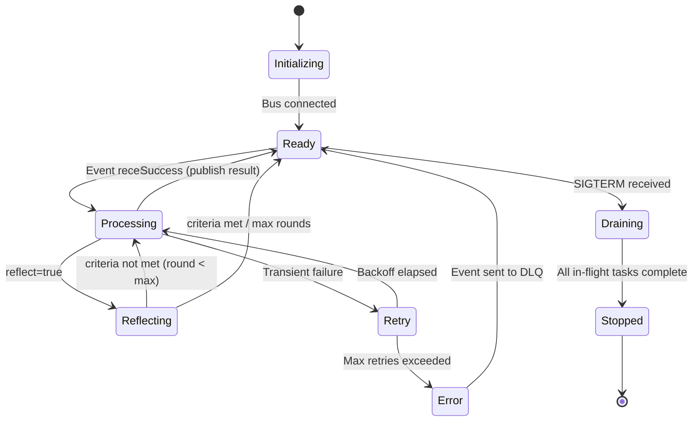

# Agent runtime, lifecycle, timeouts, retries, and concurrency

## 1. Context and problem statement

Each agent in the swarm framework is a long-lived or request-scoped service that receives events, performs reasoning (LLM calls, tool invocations), and publishes results. The **Agent Runtime** is the execution environment that manages the agent's lifecycle, concurrency, fault tolerance, and resource budgets.

**Constraints:**
- Python-first (`asyncio` as the concurrency model).
- Must support both long-lived agents (always listening) and ephemeral agents (spun up per task).
- Agents may make slow external calls (LLM inference: 1–30s; external APIs: 0.1–10s).
- Must handle partial failures gracefully (LLM timeouts, rate limits, tool errors).
- Must expose health probes for Kubernetes liveness/readiness.
- Agent state must be recoverable after a crash (stateless design preferred; state held in Shared Memory or Event Bus).

## 2. Requirements coverage

| Requirement | Coverage |
|---|---|
| R1 — Production-ready | Core: runtime must be production-grade (health, retries, graceful shutdown). |
| R3 — Horizontal scaling | Agents are independent processes; runtime supports multiple replicas via consumer groups. |
| R5 — Async with streaming | `asyncio` natively supports streaming; runtime integrates with chunk-framed protocol. |
| R6 — Built-in evaluation | Runtime invokes evaluation hooks at agent output boundaries. |
| R7 — Planning-reflection loops | Runtime supports configurable reflection cycles with depth limits. |
| R8 — Trajectory capture | Runtime emits lifecycle events (`agent.started`, `agent.heartbeat`, `agent.stopped`) to the Trajectory Store. |

## 3. Options

### Option A — Adopt an existing agent framework (LangGraph, AutoGen, CrewAI)

**Candidate technologies:**
- **LangGraph**: graph-based workflow engine (our current approach — being replaced).
- **AutoGen (Microsoft)**: multi-agent conversation framework.
- **CrewAI**: role-based agent orchestration.

**Pros:**
- Faster time to first prototype.
- Community support and pre-built patterns.

**Cons:**
- All three impose their own execution model (graph-based, conversation-loop-based, or role-based), conflicting with our event-driven, bus-centric design.
- Limited control over retry policies, timeout handling, streaming integration.
- Vendor lock: deep dependency on a fast-moving open-source project with potential breaking changes.
- None natively integrate with NATS JetStream or our event taxonomy.

**Operational implications:**
- Significant wrapping and adaptation effort negates the "buy" advantage.

### Option B — Build a lightweight Agent Runtime (recommended)

Build a thin Python runtime layer that:
1. Subscribes to the Event Bus (NATS JetStream consumer).
2. Deserializes events according to the message contract.
3. Invokes the agent's `handle(event)` method (user-defined logic).
4. Manages concurrency (configurable max-concurrent-tasks per agent instance).
5. Enforces timeouts and retries (exponential backoff with jitter).
6. Emits lifecycle events to the Trajectory Store.
7. Exposes HTTP health endpoints for Kubernetes probes.
8. Supports graceful shutdown (drain in-flight tasks, then exit).
9. On startup, registers the agent's **AgentSpec** with the **Agent Registry** (NATS KV); on shutdown, deregisters. Sends periodic heartbeats (every 30s). See [considerations/17](17_agent_registry_and_discovery.md), [ADR-0010](../adr/ADR-0010-agent-registry-agentspec.md).

**Agent lifecycle states:**

```
INITIALIZING → READY → PROCESSING → (REFLECTING) → READY → ... → DRAINING → STOPPED
                 ↑          |                             |
                 +----← RETRY (on transient failure) ←----+
                            |
                       ERROR (on permanent failure → DLQ)
```

**Pros:**
- Full control over execution model, aligned with our event-driven architecture.
- Thin layer: most complexity is in the agent's business logic, not the runtime.
- Easy to test (mock the Event Bus, inject test events).
- No dependency on external agent frameworks.

**Cons:**
- Must build and maintain: lifecycle management, retry logic, health probes, graceful shutdown.
- No community patterns to copy; must design from scratch.

**Hidden costs / risks:**
- Estimated 2–3 weeks of engineering for the core runtime.
- Ongoing maintenance: ~0.5 FTE for the first year (bug fixes, performance tuning, new features).

### Option C — Container-per-invocation (serverless / FaaS model)

Each agent invocation runs as a separate container (e.g., Knative, AWS Lambda).

**Pros:**
- Perfect isolation; no shared state between invocations.
- Auto-scaling to zero when idle.

**Cons:**
- Cold starts (1–5s) are unacceptable for interactive e-commerce chatbots.
- Stateless-by-design means every invocation must re-fetch context from Shared Memory.
- Higher cost at sustained load compared to long-lived processes.

## 4. Decision drivers

| Driver | Weight | Favors |
|---|---|---|
| **Alignment with event-driven architecture** | High | Build (Option B) |
| **Latency (no cold starts)** | High | Build (Option B) |
| **Control over retries/timeouts** | High | Build (Option B) |
| **Time to market** | Medium | Buy (Option A) |
| **Operational simplicity** | Medium | Build (simpler than wrapping a foreign framework) |

## 5. Recommendation

**Recommended: Option B — Build a lightweight Agent Runtime**

**Key design decisions:**

| Aspect | Decision |
|---|---|
| **Concurrency model** | `asyncio` with configurable `max_concurrent_tasks` per agent (default: 10). |
| **Retry policy** | Exponential backoff with jitter (base 1s, max 30s, max retries 3). Configurable per agent. |
| **Timeout** | Per-task timeout (default: 60s). Per-LLM-call timeout (default: 30s). Hard session timeout (default: 300s). |
| **Health probes** | HTTP `/healthz` (liveness), `/readyz` (readiness — connected to Event Bus and Shared Memory). |
| **Graceful shutdown** | On SIGTERM: stop consuming new events, drain in-flight tasks (30s grace period), deregister from the **Agent Registry**, then exit. |
| **Registration** | On startup: register **AgentSpec** with the **Agent Registry** (NATS KV). Runtime reads the AgentSpec from a local config file or environment. See [considerations/17](17_agent_registry_and_discovery.md). |
| **Heartbeat** | Periodic heartbeat (every 30s) updates `last_heartbeat` and `status` in the Agent Registry. Missed heartbeats trigger auto-deregistration after 90s. |
| **Reflection loop** | Optional `reflect` phase after `handle()`. Configurable: `max_reflection_rounds` (default: 2), `reflection_criteria`, `reflection_model`. |
| **Dead-letter queue** | Events that fail after max retries are published to a per-agent DLQ topic for manual investigation. |
| **Idempotency** | Agents must be idempotent. The runtime provides a deduplication layer based on `event_id` (checked against a short-lived cache in Redis). |

**Risks / mitigations:**
| Risk | Mitigation |
|---|---|
| Agent crashes mid-task | Event Bus re-delivers unacknowledged events to another instance (consumer group rebalancing). |
| LLM rate limiting | Runtime detects 429 responses and backs off; per-agent rate-limit budget tracked in Shared Memory. |
| Memory leaks in long-lived agents | Periodic agent restart (rolling restart via Kubernetes); health probe monitors memory usage. |
| Reflection loops run away | Hard cap on `max_reflection_rounds`; reflection timeout inherits from task timeout. |

## 6. Required ADRs

- [ADR-0003: Agent Runtime Model](../adr/ADR-0003-agent-runtime-model.md) — this decision.
- [ADR-0001: Messaging backbone](../adr/ADR-0001-messaging-backbone.md) — runtime depends on the Event Bus.

## 7. Diagrams



## 8. References

- Google Cloud: [Choose your agentic AI architecture components](https://docs.cloud.google.com/architecture/choose-agentic-ai-architecture-components) — agent lifecycle and runtime considerations.
- Confluent: [Multi-agent orchestrator using Flink and Kafka](https://www.confluent.io/blog/multi-agent-orchestrator-using-flink-and-kafka/) — event-driven agent execution.
