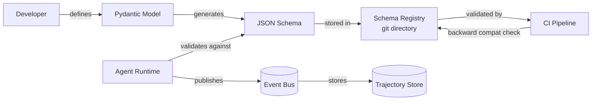

# Message schema, contracts, and governance (schema evolution)

## 1. Context and problem statement

All inter-agent communication flows through the Event Bus as structured messages. Without a well-defined message schema and governance process, the system will suffer from:
- **Schema drift**: different teams produce events with incompatible shapes.
- **Breaking changes**: consumers fail silently when unexpected fields appear or required fields disappear.
- **Poor debuggability**: logs and trajectory replays become uninterpretable without stable schemas.

**Constraints:**
- Python-first: schema tools must have strong Python support.
- Events must carry tracing metadata (`trace_id`, `span_id`) for observability.
- PII fields must be explicitly flagged for redaction.
- Schema changes must be backward-compatible by default; breaking changes require a new major version.

## 2. Requirements coverage

| Requirement | Coverage |
|---|---|
| R1 — Production-ready | Stable message contracts prevent integration failures. |
| R5 — Async with streaming | Streaming chunk events must have well-defined schema (begin, chunk, end). |
| R8 — Trajectory capture/replay | Events must be self-describing for replay to work across versions. |
| R9 — Automated prompt runs | Prompt run events must have stable schemas for CI tooling. |

## 3. Options

### Option A — JSON Schema with a lightweight schema registry

Each event type has a registered JSON Schema. A lightweight registry (file-based in git or a simple HTTP service) validates schemas at CI time and optionally at publish time.

**Pros:**
- Excellent Python support (`jsonschema`, `pydantic`).
- JSON is the lingua franca; no serialization overhead.
- Schema files live alongside code in the repository (reviewable, versionable).
- Pydantic models can auto-generate JSON Schemas.

**Cons:**
- JSON Schema lacks built-in compatibility checking (must be implemented or use a tool).
- No binary efficiency (larger payloads than Avro/Protobuf).

**Operational implications:**
- CI pipeline validates that new schema versions are backward-compatible.
- Schema registry is a git directory or a simple service (low operational burden).

### Option B — Avro with Confluent Schema Registry

Events are serialized as Avro. Confluent Schema Registry enforces compatibility.

**Pros:**
- Battle-tested compatibility checking (backward, forward, full).
- Compact binary format.
- Widely used in Kafka ecosystems.

**Cons:**
- We're not using Kafka (NATS JetStream is the chosen bus).
- Avro tooling in Python is adequate but not as ergonomic as Pydantic.
- Running Confluent Schema Registry adds operational complexity.
- Binary format is harder to inspect in logs and trajectory viewers.

### Option C — Protobuf with buf.build registry

Events are defined as Protobuf messages. `buf.build` provides linting and breaking-change detection.

**Pros:**
- Strong typing and code generation.
- Efficient binary serialization.
- `buf.build` tooling is modern and well-maintained.

**Cons:**
- Protobuf in Python has performance overhead (C extension compilation issues).
- Code generation adds build steps.
- Binary format reduces log readability.

## 4. Decision drivers

| Driver | Weight | Favors |
|---|---|---|
| Python developer experience | High | JSON Schema + Pydantic (Option A) |
| Schema evolution safety | High | All options (with appropriate tooling) |
| Log/trajectory readability | High | JSON Schema (Option A) |
| Serialization efficiency | Low (messages are small, <10KB avg) | Avro/Protobuf |
| Operational simplicity | High | JSON Schema (Option A) |

## 5. Recommendation

**Recommended: Option A — JSON Schema with Pydantic models and a git-based schema registry**

**Implementation details:**

1. **Pydantic models** define each event type. Models produce JSON Schema via `model_json_schema()`.
2. **Schema registry** lives in `schemas/` directory in the repository. CI validates backward compatibility on PR.
3. **Envelope schema** (common to all events):

```python
class EventEnvelope(BaseModel):
    event_id: str  # UUID v7
    event_type: str  # e.g., "task.completed"
    timestamp: datetime
    trace_id: str
    span_id: str
    parent_span_id: str | None = None
    session_id: str
    agent_id: str
    version: str  # semver, e.g., "1.2.0"
    payload: dict[str, Any]  # type-specific payload
    metadata: EventMetadata

class EventMetadata(BaseModel):
    correlation_id: str | None = None
    tenant_id: str | None = None
    pii_flag: bool = False
    idempotency_key: str | None = None
```

4. **Backward compatibility rules:**
   - New optional fields: allowed.
   - New required fields: forbidden (use optional with defaults).
   - Field removal: forbidden (deprecate, then remove after 2 release cycles).
   - Field type change: forbidden (create a new field).

5. **Validation at publish time:** The Event Bus client validates outgoing events against the registered schema. Invalid events are rejected with a clear error (fail-fast).

**Risks / mitigations:**
| Risk | Mitigation |
|---|---|
| Schema registry falls behind code | CI enforces schema-first: code changes to event types must include schema updates. |
| JSON payloads are large | gzip compression on the Event Bus (NATS supports this). For truly large payloads, use a reference (store payload in object storage, put URL in event). |
| PII leaks into events | `pii_flag` in metadata triggers redaction before storage in Trajectory Store. PII fields are annotated in the Pydantic model. |

## 6. Required ADRs

- [ADR-0001: Messaging backbone](../adr/ADR-0001-messaging-backbone.md) — bus carries these messages.
- Event taxonomy is in [considerations/02](02_event_taxonomy.md).

## 7. Diagrams



## 8. References

- Confluent: [Event-Driven Multi-Agent Systems](https://www.confluent.io/blog/event-driven-multi-agent-systems/) — event schema considerations.
- Google Cloud: [Choose your agentic AI architecture components](https://docs.cloud.google.com/architecture/choose-agentic-ai-architecture-components) — message contract patterns.
