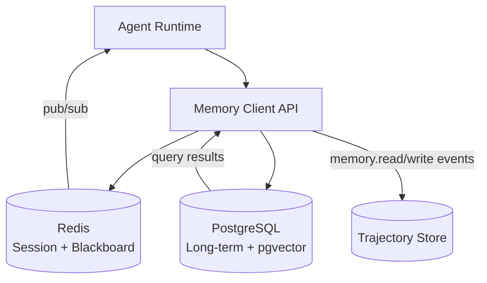

# Memory architecture: short-term/session and long-term/shared state

## 1. Context and problem statement

Agents need access to multiple layers of memory:
1. **Session memory** — current conversation context, user preferences expressed in this session, items viewed, cart state.
2. **Long-term memory** — user history across sessions, past purchases, preference profiles, resolved support tickets.
3. **Blackboard / stigmergy** — shared workspace for leaderless swarm collaboration where agents post intermediate findings.
4. **Semantic memory** — vector embeddings of product catalogs, FAQs, policies for retrieval-augmented generation (RAG).

The memory architecture must support fast reads (sub-10ms for session), durable writes, and isolation between tenants/sessions.

**Constraints:**
- Must scale horizontally for high-traffic e-commerce (Black Friday: 10x normal load).
- PII must be explicitly managed: session memory may contain customer data; long-term memory must comply with retention policies.
- Leaderless swarm agents need low-latency read-after-write semantics on the blackboard.
- Python-first with async driver support.

## 2. Requirements coverage

| Requirement | Coverage |
|---|---|
| R1 — Production-ready | Memory layer must handle production traffic with SLO guarantees. |
| R4 — Multiple communication patterns | Blackboard memory enables stigmergy-based swarm collaboration. |
| R8 — Trajectory capture | Memory reads/writes are recorded as `memory.*` events. |
| R2 — Easy agent composition | Agents access memory via a unified Memory API (no direct store access). |

## 3. Options

### Option A — Redis for everything

Use Redis for session memory, blackboard, and long-term storage (with Redis modules for vector search and persistence).

**Pros:**
- Single technology to operate.
- Sub-millisecond reads/writes.
- Redis pub/sub can support blackboard notifications.

**Cons:**
- Redis is volatile by default; RDB/AOF persistence adds operational complexity.
- Redis vector search (RediSearch) is less mature than pgvector or dedicated vector DBs.
- Long-term storage of large histories is expensive in RAM.
- Not a natural fit for complex queries (joins, aggregations) on historical data.

### Option B — Tiered architecture: Redis (session) + PostgreSQL (long-term) (recommended)

| Memory tier | Technology | Characteristics |
|---|---|---|
| **Session memory** | Redis (with TTL) | Fast, ephemeral, per-session key-value. TTL = session duration + grace period. |
| **Long-term memory** | PostgreSQL + pgvector | Durable, queryable, supports vector similarity search for RAG. |
| **Blackboard** | Redis pub/sub + hash maps | Low-latency shared workspace with change notifications; TTL-bounded per task. |
| **Semantic memory** | pgvector extension in PostgreSQL | Embedding storage and ANN search for product catalogs, FAQs, policies. |

**Pros:**
- Best tool for each tier.
- PostgreSQL is already a common enterprise dependency (operational familiarity).
- pgvector handles moderate-scale vector search without an additional service.
- Redis excels at session-scoped, high-throughput reads/writes.

**Cons:**
- Two technologies to operate (Redis + PostgreSQL).
- Cross-tier queries require application-level joins.

**Operational implications:**
- Redis: managed service (AWS ElastiCache, Azure Cache for Redis, or self-hosted with Sentinel).
- PostgreSQL: managed service (AWS RDS, Azure Database for PostgreSQL, or self-hosted).
- Backup/restore procedures for both stores.

### Option C — Tiered + dedicated vector DB (Qdrant, Weaviate)

Same as Option B but with a dedicated vector database instead of pgvector.

**Pros:**
- Better performance at very large vector scales (>10M embeddings).
- Advanced vector search features (filtering, multi-tenancy, HNSW tuning).

**Cons:**
- Third technology to operate.
- Overkill for Phase 1–2 (typical e-commerce catalog: <1M products).

**Recommendation:** Start with pgvector (Option B). If vector search latency degrades beyond SLO at scale, migrate to a dedicated vector DB in Phase 3+.

## 4. Decision drivers

| Driver | Weight | Favors |
|---|---|---|
| Read latency for session memory | High | Redis (Options A, B) |
| Durability for long-term memory | High | PostgreSQL (Options B, C) |
| Operational simplicity | High | Option B (two well-known technologies) |
| Vector search maturity | Medium | Option C at scale; Option B is sufficient initially |
| Blackboard change notifications | Medium | Redis pub/sub (Options A, B) |

## 5. Recommendation

**Recommended: Option B — Tiered (Redis + PostgreSQL/pgvector)**

**Unified Memory API:**

Agents interact with a `MemoryClient` abstraction that routes to the appropriate backend:

```python
class MemoryClient:
    async def session_get(self, session_id: str, key: str) -> Any: ...
    async def session_set(self, session_id: str, key: str, value: Any, ttl: int = 3600): ...
    async def long_term_store(self, user_id: str, record: MemoryRecord): ...
    async def long_term_query(self, user_id: str, query: str, top_k: int = 5) -> list[MemoryRecord]: ...
    async def blackboard_post(self, task_id: str, key: str, value: Any): ...
    async def blackboard_read(self, task_id: str) -> dict[str, Any]: ...
    async def blackboard_subscribe(self, task_id: str) -> AsyncIterator[BlackboardUpdate]: ...
    async def vector_search(self, query_embedding: list[float], top_k: int = 10) -> list[VectorResult]: ...
```

**Data retention:**
- Session memory: TTL = session duration + 1 hour.
- Blackboard: TTL = task timeout + 5 minutes (auto-evict after swarm completes).
- Long-term memory: retention per compliance policy (default: 2 years; PII: per GDPR/CCPA deletion requests).

**Risks / mitigations:**
| Risk | Mitigation |
|---|---|
| Redis data loss on crash | Enable AOF persistence; for critical data, write-through to PostgreSQL. |
| Blackboard contention during swarm | Use Redis optimistic locking (WATCH/MULTI) or CAS operations for conflict resolution. |
| pgvector performance at scale | Monitor query latency; if p95 > 50ms, plan migration to dedicated vector DB. |
| PII in memory stores | Memory API enforces PII tagging; session memory redacts PII on TTL expiry; long-term memory supports deletion requests. |

## 6. Required ADRs

- [ADR-0004: Memory and state strategy](../adr/ADR-0004-memory-state-strategy.md) — this decision.

## 7. Diagrams



## 8. References

- De Nicola et al.: [Multi-agent systems with virtual stigmergy](https://www.sciencedirect.com/science/article/pii/S016764231930139X) — blackboard/stigmergy patterns.
- Google Cloud: [Choose your agentic AI architecture components](https://docs.cloud.google.com/architecture/choose-agentic-ai-architecture-components) — memory and state management.
