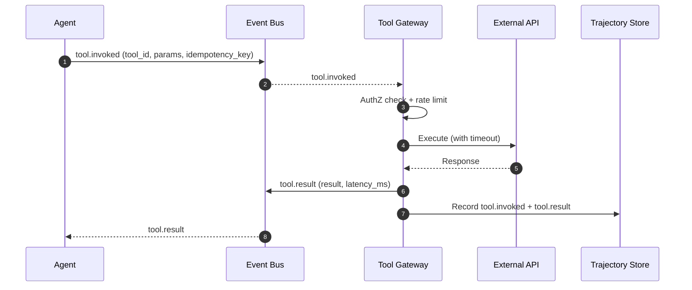

# Tool gateway: tool calling, permissions, and external integrations

## 1. Context and problem statement

Agents accomplish tasks by invoking **tools** — functions that interact with external systems (product catalog API, order management, payment gateway, shipping tracker, CRM). The Tool Gateway provides a unified, secure, auditable interface for all tool invocations.

**Constraints:**
- E-commerce tools include sensitive operations (place order, issue refund, access customer PII). AuthZ is mandatory.
- External APIs have rate limits; the gateway must enforce per-tool rate budgets.
- Tool calls must be **idempotent** where possible (retries must not cause duplicate orders).
- All tool invocations must be logged to the Trajectory Store for audit and replay.
- Some tools are slow (payment processing: 2–5s); the gateway must support async invocation with callbacks.

## 2. Requirements coverage

| Requirement | Coverage |
|---|---|
| R1 — Production-ready | Tool Gateway enforces security, rate limits, and audit. |
| R6 — Evaluation | Tool-call boundary is the first evaluation checkpoint. |
| R8 — Trajectory capture | Every `tool.invoked` and `tool.result` event is recorded. |
| R10 — Protocol wrappers | External tools exposed via MCP are consumed through the Tool Gateway. |

## 3. Options

### Option A — Direct tool invocation (no gateway)

Agents call tools directly (HTTP calls, SDK imports).

**Pros:**
- Simplest implementation.
- No additional latency.

**Cons:**
- No centralized authZ, rate limiting, or audit.
- Each agent must implement its own retry logic, circuit breakers, and error handling.
- Tool changes require updating every agent that uses the tool.
- No idempotency enforcement.

### Option B — Centralized Tool Gateway service (recommended)

A dedicated service that:
1. Receives tool call requests from agents (via Event Bus or direct async call).
2. Validates the request against a tool registry (does this tool exist? does this agent have permission?).
3. Applies rate limiting and circuit breaking.
4. Executes the tool call with configurable timeout and retries.
5. Records `tool.invoked` and `tool.result` (or `tool.error`) events to the Trajectory Store.
6. Returns the result to the requesting agent.

**Tool registry schema:**

| Field | Description |
|---|---|
| `tool_id` | Unique identifier (e.g., `product-catalog.search`). |
| `description` | Human-readable description (used in agent prompts for tool selection). |
| `input_schema` | JSON Schema for tool input parameters. |
| `output_schema` | JSON Schema for tool output. |
| `permissions` | List of agent roles allowed to invoke this tool. |
| `rate_limit` | Max invocations per minute (per agent, per session, or per tenant). |
| `timeout` | Max execution time (default: 10s). |
| `idempotency` | Whether the tool supports idempotency keys. |
| `side_effects` | `read-only`, `write`, `payment` — determines evaluation rigor. |

**Pros:**
- Centralized security, audit, and governance.
- Tool changes are isolated; agents interact with a stable API.
- Idempotency keys prevent duplicate side effects on retries.
- Rate limiting protects downstream systems.

**Cons:**
- Adds latency (one extra hop through the gateway).
- The gateway is a critical path component; must be highly available.

### Option C — Sidecar / middleware pattern

Tool gateway logic runs as a sidecar or middleware library within each agent process.

**Pros:**
- No extra network hop.
- Distributed; no single point of failure.

**Cons:**
- Harder to enforce consistent policies (each agent runs its own copy).
- Updates require redeploying all agents.
- Audit log aggregation is more complex.

## 4. Decision drivers

| Driver | Weight | Favors |
|---|---|---|
| Security (authZ, audit) | High | Centralized gateway (Option B) |
| Operational simplicity | High | Centralized gateway (Option B) |
| Latency | Medium | Sidecar (Option C) |
| Rate limit enforcement | High | Centralized gateway (Option B) |
| Idempotency governance | High | Centralized gateway (Option B) |

## 5. Recommendation

**Recommended: Option B — Centralized Tool Gateway service**

**Key design decisions:**

| Aspect | Decision |
|---|---|
| **Communication** | Agents publish `tool.invoked` events to the Event Bus; Tool Gateway consumes, executes, and publishes `tool.result`. For latency-critical tools, agents use a direct async RPC to the gateway. |
| **AuthZ** | Role-based: the gateway checks `agent_id` against the tool's `permissions` list. |
| **Rate limiting** | Token bucket per tool per tenant. Configurable per tool in the registry. |
| **Idempotency** | Agents include an `idempotency_key` in the request. Gateway deduplicates using a short-lived Redis cache (TTL: 5 minutes). |
| **Circuit breaking** | If a downstream tool fails 5 consecutive times, the circuit opens for 30s. Agents receive a `tool.error` with `circuit_open=true`. |
| **Timeout** | Configurable per tool (default: 10s). Gateway cancels the call and returns `tool.error` with `timeout=true`. |
| **MCP integration** | External MCP tool servers are registered in the tool registry with an MCP transport adapter. The gateway handles MCP protocol translation. |

**Risks / mitigations:**
| Risk | Mitigation |
|---|---|
| Gateway becomes a bottleneck | Stateless gateway; horizontally scaled behind a load balancer. |
| Gateway outage blocks all tool calls | Circuit breakers fail open for read-only tools (return cached results). Critical write tools fail closed (agent retries). |
| Idempotency key collisions | Keys are UUID v7 (time-ordered, unique). |
| Slow tools block the event loop | Gateway runs tool calls in a thread pool executor (`asyncio.to_thread`). |

## 6. Required ADRs

- Tool Gateway design is implicit across multiple ADRs but primarily covered in:
  - [ADR-0001: Messaging backbone](../adr/ADR-0001-messaging-backbone.md) — tool events flow through the Event Bus.
  - [ADR-0008: Protocol Gateway](../adr/ADR-0008-protocol-gateway-mcp-a2a.md) — MCP tool integration.

## 7. Diagrams

## 8. References

- Google Cloud: [Choose your agentic AI architecture components](https://docs.cloud.google.com/architecture/choose-agentic-ai-architecture-components) — tool integration patterns.
- Confluent: [Multi-agent orchestrator using Flink and Kafka](https://www.confluent.io/blog/multi-agent-orchestrator-using-flink-and-kafka/) — tool invocation in event-driven systems.
