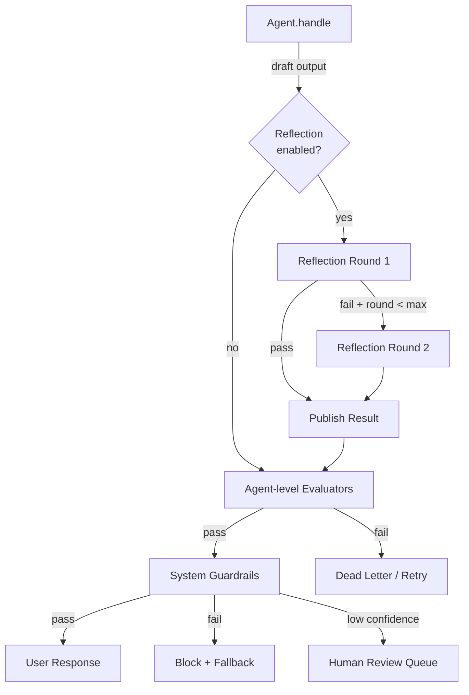

# Evaluation, reflection loops, and safety guardrails

## 1. Context and problem statement

LLM-based agents produce non-deterministic outputs that may be incorrect, harmful, or off-brand. The Evaluation Layer provides structured quality gates at multiple boundaries in the agent pipeline:

1. **Tool-call boundary**: Is this tool call safe, authorized, and well-formed?
2. **Agent output boundary**: Is this agent's response relevant, factual, and high-quality?
3. **System response boundary**: Is the final user-facing response safe, compliant, and complete?

Additionally, agents should support **planning-reflection loops** where they self-critique and revise their output before publishing it.

**Constraints:**
- Evaluation must not add more than 500ms p95 latency for synchronous guardrails.
- Must support both **LLM-as-judge** evaluators and **rule-based** evaluators (regex, keyword lists, classifiers).
- Evaluation results must be recorded in the Trajectory Store for analysis.
- Reflection loops must be bounded (prevent infinite self-revision).

## 2. Requirements coverage

| Requirement | Coverage |
|---|---|
| R6 — Built-in evaluation abstractions | Core: defines per-agent and system-level evaluation. |
| R7 — Planning-reflection loops | Reflection is a parameterized phase in the Agent Runtime. |
| R8 — Trajectory capture | Evaluation events (`eval.requested`, `eval.passed`, `eval.failed`, `eval.reflection`) are stored. |
| R9 — Automated prompt runs | Evaluation metrics are computed during CI prompt regression runs. |

## 3. Options

### Option A — External evaluation service (e.g., Patronus AI, Galileo, Arthur AI)

Use a third-party evaluation platform that agents call post-generation.

**Pros:**
- Pre-built evaluators for hallucination, toxicity, relevance, faithfulness.
- Managed service: no maintenance.
- Often includes dashboards and analytics.

**Cons:**
- Adds network latency (external API call per evaluation).
- Cost: per-invocation pricing can be significant at scale.
- Data privacy: sending agent outputs to a third party for evaluation.
- Limited customization for domain-specific evaluations (e-commerce product accuracy, pricing correctness).

**Operational implications:**
- Vendor dependency; SLA alignment required.
- Must handle evaluation service outages (fail-open or fail-closed?).

### Option B — Built-in evaluation framework (recommended)

Build an evaluation framework as part of the platform:
1. **Evaluator interface**: a simple `evaluate(input, output, context) -> EvalResult` contract.
2. **Evaluator registry**: evaluators are registered per agent, per tool, and at the system boundary.
3. **Evaluator types**:
   - **Rule-based**: regex, keyword blocklists, PII detectors, price-range validators, SQL injection detectors.
   - **LLM-as-judge**: a separate (cheaper/faster) LLM call that scores the output on specified dimensions.
   - **Classifier-based**: fine-tuned classifiers for toxicity, sentiment, brand-voice compliance.
4. **Evaluation pipeline**: evaluators run as a chain; any evaluator can fail the response.

**Pros:**
- Full control over evaluation logic, latency, and data privacy.
- Domain-specific evaluators for e-commerce (product spec accuracy, pricing, inventory checks).
- No external data exposure.
- Evaluation results are first-class events in the Trajectory Store.

**Cons:**
- Must build and maintain evaluators.
- LLM-as-judge adds LLM cost (mitigated by using a cheap model like GPT-4o-mini).

### Option C — Hybrid (built-in + optional external)

Build the evaluation framework in-house (Option B) but support plugging in external evaluators as additional evaluator types.

**Pros:**
- Best of both worlds: domain-specific in-house evaluators + specialized third-party evaluators for general safety.

**Cons:**
- Integration complexity with external APIs.

## 4. Decision drivers

| Driver | Weight | Favors |
|---|---|---|
| Data privacy | High | Built-in (Option B) |
| Domain-specific evaluation | High | Built-in (Option B) |
| Latency budget | High | Built-in (Option B, no network round-trip) |
| Time to market | Medium | External (Option A, pre-built) |
| Extensibility | Medium | Hybrid (Option C) |

## 5. Recommendation

**Recommended: Option B — Built-in evaluation framework, with Option C extensibility for Phase 3+**

**Evaluator configuration per agent:**

```python
@agent(
    evaluators=[
        RuleEvaluator(rules=["no_pii", "no_sql_injection"]),
        LLMJudgeEvaluator(
            model="gpt-4o-mini",
            criteria=["relevance", "factuality", "tone"],
            threshold=0.7
        ),
    ],
    reflection=ReflectionConfig(
        enabled=True,
        max_rounds=2,
        criteria=["completeness", "accuracy"],
        model="gpt-4o-mini"
    ),
    system_guardrails=[
        ToxicityClassifier(threshold=0.95),
        BrandVoiceEvaluator(brand_profile="acme-shopping"),
        PriceAccuracyEvaluator()
    ]
)
class ProductRecommendationAgent(BaseAgent):
    async def handle(self, event: Event) -> AgentOutput: ...
```

**Reflection loop flow:**

```
Agent.handle(event) → draft_output
  ↓
Reflection round 1:
  Reflector LLM evaluates draft_output against criteria
  → Pass: publish draft_output
  → Fail: revise draft_output, loop to round 2
  ↓
Reflection round 2 (last round):
  Reflector evaluates revised output
  → Pass or fail: publish (with metadata indicating reflection outcome)
```

**System-level guardrails (mandatory, non-configurable):**
| Guardrail | Type | Action on failure |
|---|---|---|
| Toxicity filter | Classifier | Block response; return safe fallback. |
| PII leak detection | Rule-based | Redact PII; log alert. |
| Content policy | LLM-as-judge | Block response; escalate to human review queue. |

**Risks / mitigations:**
| Risk | Mitigation |
|---|---|
| LLM-as-judge is slow | Use GPT-4o-mini or equivalent fast model; cache evaluations for identical outputs. |
| Reflection loops increase latency | Reflection is optional and bounded; default max 2 rounds. Reflection timeout inherits from task timeout. |
| False positives (guardrail blocks valid response) | Guardrails log confidence; low-confidence blocks are sent to human review queue instead of hard-blocking. |
| Evaluation cost at scale | Rule-based evaluators are free. LLM-as-judge is used selectively (only for agent output and system boundaries, not every tool call). |

## 6. Required ADRs

- [ADR-0006: Evaluation and guardrails approach](../adr/ADR-0006-evaluation-guardrails.md) — this decision.

## 7. Diagrams



## 8. References

- Google Cloud: [Choose a design pattern for your agentic AI system](https://docs.cloud.google.com/architecture/choose-design-pattern-agentic-ai-system) — evaluation and loop patterns.
- Confluent: [Event-Driven Multi-Agent Systems](https://www.confluent.io/blog/event-driven-multi-agent-systems/) — quality gates in event-driven flows.
