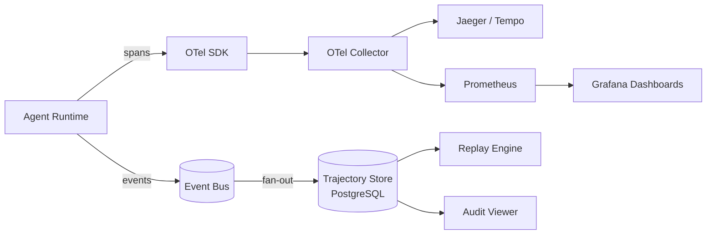

# Observability, tracing, trajectory capture, and replay

## 1. Context and problem statement

A multi-agent system is inherently difficult to debug: a single user request may trigger events across 5–10 agents, multiple tool calls, and evaluation loops. Without first-class observability, diagnosing latency issues, failures, or incorrect outputs requires manual log stitching.

The framework needs:
1. **Distributed tracing**: correlate all events in a single user request across agents.
2. **Structured logging**: machine-readable logs with consistent fields.
3. **Metrics**: latency, throughput, error rate, cost, and token usage per agent/tool/session.
4. **Trajectory Store**: append-only event log for full replay and audit.
5. **Replay engine**: reconstruct past conversations for debugging, evaluation, and regression testing.

**Constraints:**
- Must support high event volume (1000+ events/second during peak traffic).
- Trajectory data must be retained per compliance requirements (minimum 90 days for audit; configurable).
- Replay must work across schema versions (events are versioned).
- Cost tracking must attribute LLM token usage to specific agents, sessions, and tenants.

## 2. Requirements coverage

| Requirement | Coverage |
|---|---|
| R8 — Trajectory capture/replay | Core: this section defines trajectory capture and replay. |
| R9 — Automated prompt runs | Replay engine powers CI regression testing. |
| R1 — Production-ready | Observability is a prerequisite for production operations. |

## 3. Options

### Option A — Use a managed observability platform (Datadog, New Relic, Honeycomb)

**Pros:**
- Pre-built dashboards, alerting, AIOps, and anomaly detection.
- Managed storage and retention.
- Team already familiar with the platform (assumption).

**Cons:**
- Cost scales linearly with event volume; high-cardinality trace data is expensive.
- Observability platform cannot serve as a Trajectory Store for replay (data model mismatch).
- Limited ability to run custom replay queries.

### Option B — OpenTelemetry + custom Trajectory Store (recommended)

Use **OpenTelemetry (OTel)** for tracing and metrics export; build a **Trajectory Store** as an append-only PostgreSQL table for replay and audit.

**Architecture:**

| Component | Technology | Purpose |
|---|---|---|
| **Tracing SDK** | OpenTelemetry Python SDK | Instrument agents, Tool Gateway, Event Bus client. Emit spans with `trace_id`, `span_id`, `parent_span_id`. |
| **Trace collector** | OTel Collector | Receive spans, batch, and export to backend. |
| **Trace backend** | Jaeger or Tempo (Grafana) | Store trace data for visualization and querying. |
| **Metrics** | Prometheus + Grafana | Agent latency, throughput, error rate, token usage, cost. |
| **Structured logging** | `structlog` (Python) | JSON-formatted logs with `trace_id`, `agent_id`, `session_id`. |
| **Trajectory Store** | PostgreSQL (append-only table) | Every event envelope is stored with its full payload. Indexed by `trace_id`, `session_id`, `agent_id`, `timestamp`. |
| **Replay engine** | Custom Python service | Reads events from Trajectory Store, replays them through agents (deterministic or best-effort). |

**Pros:**
- OTel is the industry standard; vendor-neutral.
- Trajectory Store gives us full-fidelity replay (not just trace visualizations).
- Clear separation: OTel for live observability; Trajectory Store for audit/replay.
- PostgreSQL is already in the stack (from memory architecture).

**Cons:**
- Must build the Trajectory Store schema and replay engine.
- OTel instrumentation requires wrapping every agent and tool call.

### Option C — Event sourcing with Kafka / NATS log

Use the Event Bus itself as the event log (NATS JetStream retains all events).

**Pros:**
- No separate Trajectory Store; the bus IS the log.
- Natural event sourcing.

**Cons:**
- NATS JetStream retention is time-based or size-based; long-term audit requires external archival.
- Querying NATS for replay is less ergonomic than SQL queries on PostgreSQL.
- Mixing operational events and audit data on the same bus complicates capacity planning.

## 4. Decision drivers

| Driver | Weight | Favors |
|---|---|---|
| Replay fidelity | High | Option B (dedicated Trajectory Store) |
| Long-term audit retention | High | Option B (PostgreSQL with configurable retention) |
| Industry-standard tracing | High | Option B (OpenTelemetry) |
| Operational simplicity | Medium | Option C (fewer components) |
| Cost | Medium | Option B (self-hosted Prometheus/Grafana; PostgreSQL already in stack) |

## 5. Recommendation

**Recommended: Option B — OpenTelemetry + custom Trajectory Store in PostgreSQL**

**Trajectory Store schema:**

```sql
CREATE TABLE trajectory_events (
    id              BIGSERIAL PRIMARY KEY,
    event_id        UUID NOT NULL UNIQUE,
    trace_id        UUID NOT NULL,
    span_id         UUID NOT NULL,
    parent_span_id  UUID,
    session_id      UUID NOT NULL,
    agent_id        VARCHAR(255) NOT NULL,
    event_type      VARCHAR(255) NOT NULL,
    timestamp       TIMESTAMPTZ NOT NULL,
    version         VARCHAR(50) NOT NULL,
    payload         JSONB NOT NULL,
    metadata        JSONB NOT NULL DEFAULT '{}',
    tenant_id       VARCHAR(255),
    created_at      TIMESTAMPTZ NOT NULL DEFAULT NOW()
);

CREATE INDEX idx_trajectory_trace ON trajectory_events (trace_id);
CREATE INDEX idx_trajectory_session ON trajectory_events (session_id);
CREATE INDEX idx_trajectory_agent ON trajectory_events (agent_id, timestamp);
CREATE INDEX idx_trajectory_type ON trajectory_events (event_type, timestamp);
```

**Replay modes:**

| Mode | Mechanism | Use case |
|---|---|---|
| **Cost-free replay** | Read events from Trajectory Store, render in a viewer (no execution). | Audit, debugging, incident investigation. |
| **Deterministic replay** | Replay events through agents; tool calls return cached responses from the Trajectory Store. | Regression testing, prompt evaluation. |
| **Best-effort replay** | Replay events through agents; LLM calls are re-invoked (non-deterministic). | Evaluating prompt changes against historical inputs. |

**Cost tracking:**

Every LLM call records:
```json
{
  "model": "gpt-4o",
  "input_tokens": 1500,
  "output_tokens": 300,
  "cost_usd": 0.012,
  "agent_id": "product-search-agent",
  "session_id": "...",
  "tenant_id": "acme-corp"
}
```

Grafana dashboards aggregate cost by agent, tenant, and time period.

**Risks / mitigations:**
| Risk | Mitigation |
|---|---|
| Trajectory Store grows large | Partition by month; archive older partitions to cold storage (S3). Configurable retention per tenant. |
| OTel instrumentation overhead | Sampling: trace 100% in dev/staging; 10% in production (with 100% for errors). |
| Replay with stale schemas | Events carry `version`; replay engine uses schema migration adapters. |
| Cost tracking inaccuracy | Token counts come from LLM provider response headers; validate against billing. |

## 6. Required ADRs

- [ADR-0007: Observability and replay](../adr/ADR-0007-observability-replay.md) — this decision.

## 7. Diagrams



## 8. References

- OpenTelemetry: [Python SDK documentation](https://opentelemetry.io/docs/instrumentation/python/).
- Google Cloud: [Choose your agentic AI architecture components](https://docs.cloud.google.com/architecture/choose-agentic-ai-architecture-components) — observability patterns.
- Confluent: [Event-Driven Multi-Agent Systems](https://www.confluent.io/blog/event-driven-multi-agent-systems/) — event logging and replay.
