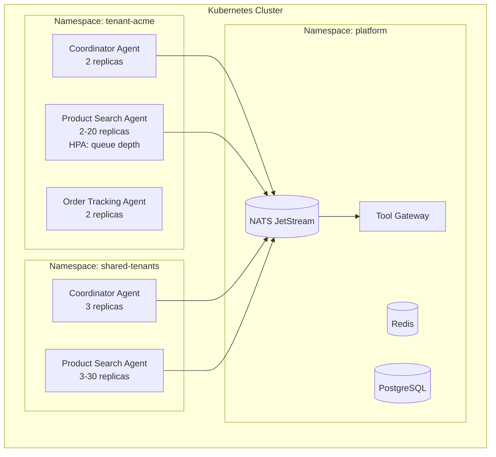

# Scaling, deployment, isolation boundaries, and multi-tenancy

## 1. Context and problem statement

The agentic swarm framework must support e-commerce traffic patterns characterized by:
- **Spiky traffic**: flash sales (10x baseline), holiday peaks (5x sustained for weeks).
- **Multi-tenancy**: multiple product teams or business units share the platform.
- **Isolation**: a misbehaving agent or tenant must not degrade others.
- **Cost efficiency**: agents should scale to zero (or near-zero) when idle.

**Constraints:**
- Kubernetes is the assumed deployment platform (internal engineering standard).
- Python-first agents; container images must be lightweight.
- Stateless agents (state in Shared Memory / Event Bus); enables horizontal scaling.
- Must support canary and blue-green deployments for agent updates.

## 2. Requirements coverage

| Requirement | Coverage |
|---|---|
| R1 — Production-ready | Scaling, HA, and isolation are production prerequisites. |
| R3 — Horizontal scaling | Core: defines how agents scale. |
| R2 — Easy creation of assistants | Product teams deploy agents via standardized Helm charts. |

## 3. Options

### Option A — Monolithic deployment (all agents in one process)

**Pros:**
- Simplest deployment; single container.

**Cons:**
- No independent scaling; the entire system scales together.
- One agent failure can crash the entire process.
- Cannot allocate different resources to different agents.

### Option B — Per-agent-type Kubernetes Deployments (recommended)

Each agent type (e.g., `product-search-agent`, `order-tracking-agent`, `coordinator-agent`) is a separate Kubernetes Deployment with its own replica count, resource limits, and HPA configuration.

**Pros:**
- Independent scaling: hot agents (product search during flash sales) scale up without scaling everything.
- Fault isolation: a crashing agent type does not affect others.
- Independent deployments: update one agent type without redeploying others.
- Resource tuning: memory-heavy agents get more RAM; CPU-bound agents get more CPU.

**Cons:**
- More Kubernetes objects to manage (one Deployment, Service, HPA per agent type).
- Must standardize agent packaging (Docker image, Helm chart, config).

**Operational implications:**
- Standardized Helm chart template for agent deployments.
- HPA scaling metric: Event Bus queue depth (NATS JetStream pending message count per consumer group).
- Pod disruption budgets ensure rolling updates do not drop inflight tasks.

### Option C — Serverless / Knative (scale to zero)

**Pros:**
- True scale-to-zero for rarely used agents.
- Automatic scaling based on request volume.

**Cons:**
- Cold start latency (1–5s) is unacceptable for interactive chat.
- Less control over scaling behavior.
- Complex networking for Event Bus integration.

**Operational implications:**
- Only viable for non-interactive batch agents (e.g., nightly report generators).

## 4. Decision drivers

| Driver | Weight | Favors |
|---|---|---|
| Independent agent scaling | High | Option B |
| Latency (no cold starts) | High | Option B |
| Fault isolation | High | Option B |
| Operational simplicity | Medium | Option A |
| Cost efficiency at idle | Low | Option C |

## 5. Recommendation

**Recommended: Option B — Per-agent-type Kubernetes Deployments**

**Multi-tenancy model:**

| Approach | Description | Recommendation |
|---|---|---|
| **Namespace per tenant** | Each tenant gets a dedicated Kubernetes namespace with its own agent deployments and NATS subjects. | Recommended for large tenants (separate business units) or strict compliance isolation. |
| **Shared namespace with tenant-ID filtering** | All tenants share agent deployments; `tenant_id` in the event envelope routes and isolates data. | Recommended for small tenants or quick onboarding. |
| **Hybrid** | Large tenants get dedicated namespaces; smaller tenants share a common namespace. | Phase 3+ when tenant count grows. |

**Scaling configuration:**

```yaml
# Example HPA for product-search-agent
apiVersion: autoscaling/v2
kind: HorizontalPodAutoscaler
metadata:
  name: product-search-agent-hpa
spec:
  scaleTargetRef:
    apiVersion: apps/v1
    kind: Deployment
    name: product-search-agent
  minReplicas: 2
  maxReplicas: 20
  metrics:
    - type: External
      external:
        metric:
          name: nats_jetstream_pending_messages
          selector:
            matchLabels:
              consumer_group: product-search-agent
        target:
          type: AverageValue
          averageValue: "50"
```

**Deployment strategy:**
- **Canary**: new agent version receives 10% of traffic; if error rate < threshold for 15 minutes, promote to 100%.
- **Blue-green**: for critical agents (coordinator), maintain two full deployments; switch traffic atomically.
- **Rolling update**: default for most agents; `maxSurge: 25%`, `maxUnavailable: 0` (zero-downtime).

**Isolation boundaries:**

| Dimension | Mechanism |
|---|---|
| **CPU/Memory** | Kubernetes resource requests and limits per agent pod. |
| **Event Bus** | Separate NATS subject prefixes per tenant (e.g., `tenant.acme.task.*`). |
| **Shared Memory** | Redis key prefixes and/or separate Redis databases per tenant. |
| **Rate limits** | Per-tenant token budgets enforced at the Event Bus and LLM gateway. |
| **Network** | Kubernetes NetworkPolicies restrict agent-to-agent communication to the Event Bus. |

**Risks / mitigations:**
| Risk | Mitigation |
|---|---|
| Too many Deployments (operational burden) | Standardized Helm chart template; GitOps (ArgoCD/Flux) for declarative management. |
| HPA scaling too slow for flash-sale spikes | Pre-scale before known events (scheduled HPA); KEDA for event-driven scaling. |
| Noisy neighbor (one tenant consumes all LLM budget) | Per-tenant token budget enforced at the LLM gateway; alerts on budget exhaustion. |
| Config drift between environments | GitOps ensures dev/staging/prod configs are identical except for scale parameters. |

## 6. Required ADRs

- [ADR-0009: Deployment, scaling, and isolation](../adr/ADR-0009-deployment-scaling-isolation.md) — this decision.

## 7. Diagrams



## 8. References

- Google Cloud: [Choose your agentic AI architecture components](https://docs.cloud.google.com/architecture/choose-agentic-ai-architecture-components) — deployment and scaling patterns.
- Confluent: [Multi-agent orchestrator using Flink and Kafka](https://www.confluent.io/blog/multi-agent-orchestrator-using-flink-and-kafka/) — scaling event-driven agents.
