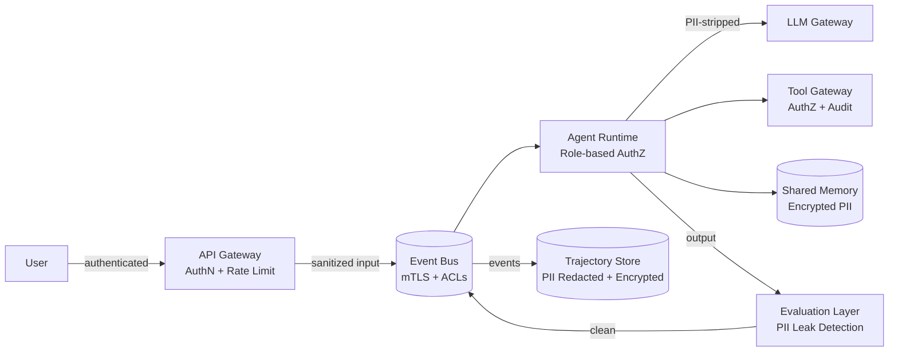

# Security, privacy, compliance, and auditability

## 1. Context and problem statement

An e-commerce agentic system handles sensitive data: customer PII (names, addresses, payment info), order history, and business-critical operations (refunds, price changes). Security failures can result in data breaches, regulatory penalties, and reputational damage.

**Constraints:**
- Must comply with GDPR, CCPA, and PCI-DSS (for payment-adjacent operations).
- LLM providers (external APIs) must not receive raw PII.
- All agent actions must be auditable (who did what, when, why).
- Internal threat model includes: prompt injection, unauthorized tool use, data exfiltration via agent outputs.

## 2. Requirements coverage

| Requirement | Coverage |
|---|---|
| R1 — Production-ready | Security is a production gate. |
| R8 — Trajectory capture | Trajectory Store provides audit trail (this section defines what is captured and redacted). |
| R6 — Evaluation | Guardrails prevent harmful/unauthorized outputs. |

## 3. Options

### Option A — Perimeter-only security

Secure at the API gateway; trust all internal components.

**Pros:**
- Simplest implementation.

**Cons:**
- Internal compromise is unrestricted (no defense in depth).
- Agent prompt injection could bypass perimeter controls.
- Not compliant with PCI-DSS requirement for internal segmentation.

### Option B — Defense-in-depth with per-layer controls (recommended)

Apply security controls at every layer: ingress, Event Bus, Tool Gateway, Shared Memory, and egress.

| Layer | Controls |
|---|---|
| **Ingress (API Gateway)** | Authentication (JWT/OAuth2), rate limiting, input validation, injection detection. |
| **Event Bus** | Mutual TLS between agents and NATS. Topic-level ACLs (agents can only publish/subscribe to authorized topics). |
| **Tool Gateway** | Role-based authZ per tool. Sensitive tools (refund, payment) require elevated authorization with confirmation events. |
| **Shared Memory** | Key-prefix isolation per tenant/session. PII fields encrypted at rest (AES-256). |
| **LLM Gateway** | PII stripping before sending prompts to external LLM providers. Token budget enforcement. |
| **Evaluation Layer** | PII leak detection in agent outputs. Content safety guardrails. |
| **Trajectory Store** | PII redaction before storage. Immutable audit log. Configurable retention per compliance policy. |
| **Egress** | Final response scanned for PII before delivery to user channel. |

**Pros:**
- Defense in depth: compromise of one layer does not expose the entire system.
- Compliance-ready: audit trail, PII controls, and access restrictions meet GDPR/CCPA/PCI-DSS requirements.

**Cons:**
- Higher implementation and operational complexity.
- Performance overhead from encryption, validation, and scanning at each layer.

## 4. Decision drivers

| Driver | Weight | Favors |
|---|---|---|
| Regulatory compliance | High | Defense-in-depth (Option B) |
| Data protection | High | Defense-in-depth (Option B) |
| Audit requirements | High | Defense-in-depth (Option B) |
| Operational simplicity | Low | Perimeter-only (Option A) |

## 5. Recommendation

**Recommended: Option B — Defense-in-depth**

**PII handling pipeline:**

```
User input → PII detector (at ingress)
  → If PII detected: tag fields, replace with placeholders in LLM context
  → Agent processing (PII-free context)
  → Agent output → PII leak detector (at evaluation boundary)
  → If PII leaked: redact and log alert
  → Trajectory Store: PII fields stored encrypted, flagged for time-limited retention
  → User response: PII re-hydrated from session memory (if needed for personalization)
```

**Prompt injection defense:**
| Attack vector | Mitigation |
|---|---|
| User input contains adversarial instructions | Input sanitization at ingress; guardrail evaluator detects prompt injection patterns. |
| Agent output contains adversarial instructions for downstream agents | Inter-agent messages are validated against schema; Evaluation Layer detects anomalous outputs. |
| Tool output contains injected content | Tool Gateway sanitizes tool responses before returning to agent. |

**Access control model:**

```yaml
roles:
  - name: shopping-assistant
    tools: [product-catalog.search, product-catalog.details, cart.add, cart.view]
    topics: [task.*, message.*, stream.*]
    memory: [session.read, session.write]

  - name: order-manager
    tools: [order.status, order.cancel, refund.initiate]
    topics: [task.*, message.*]
    memory: [session.read, session.write, long_term.read]
    elevated_tools: [refund.initiate]  # Requires confirmation event

  - name: coordinator
    tools: [all]
    topics: [all]
    memory: [all]
```

**Risks / mitigations:**
| Risk | Mitigation |
|---|---|
| PII reaches external LLM | LLM Gateway strips PII using NER; fallback: regex patterns for known PII formats (email, phone, SSN). |
| Agent escalation attack (agent claims elevated role) | Agent identity is established at startup via mTLS certificate; roles are assigned by the platform, not self-declared. |
| Trajectory Store data breach | Encryption at rest (AES-256); access restricted to audit roles; PII fields encrypted with per-tenant keys. |
| Right-to-be-forgotten (GDPR) | Trajectory Store supports deletion by `session_id` or `user_id`; PII fields are encrypted with a per-user key that can be destroyed. |

## 6. Required ADRs

- Security decisions are cross-cutting; documented in relevant component ADRs. Most directly:
  - [ADR-0009: Deployment and isolation](../adr/ADR-0009-deployment-scaling-isolation.md) — network and namespace isolation.
  - [ADR-0006: Evaluation and guardrails](../adr/ADR-0006-evaluation-guardrails.md) — security guardrails.

## 7. Diagrams



## 8. References

- Google Cloud: [Choose your agentic AI architecture components](https://docs.cloud.google.com/architecture/choose-agentic-ai-architecture-components) — security and compliance patterns.
