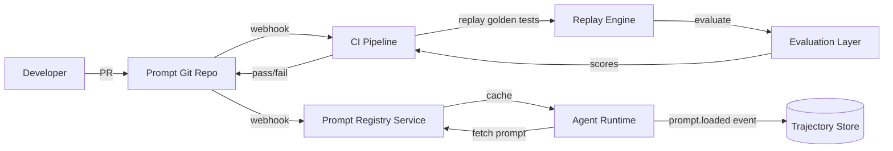

# Prompt management, versioning, and automated prompt runs

## 1. Context and problem statement

Agent behavior is primarily defined by **prompts** — system instructions, few-shot examples, and tool descriptions. Prompt changes are the most frequent "code" changes in an agentic system, yet they are often managed in an ad-hoc manner (hardcoded strings, unversioned configs).

The framework needs:
1. A **Prompt Registry** that stores versioned prompt templates.
2. **Environment promotion** (dev → staging → production) with rollback capability.
3. **Automated prompt regression runs** in CI to catch quality regressions before deployment.
4. **A/B testing** support for comparing prompt variants in production.

**Constraints:**
- Prompts may contain dynamic variables (user context, product data); the registry stores templates, not rendered prompts.
- Prompt changes are high-risk (a bad prompt can degrade all agent responses).
- Regression testing requires golden datasets of (input, expected_output) pairs with evaluation metrics.
- Must integrate with the Evaluation Layer for scoring regression run outputs.

## 2. Requirements coverage

| Requirement | Coverage |
|---|---|
| R9 — Automated prompt runs | Core: CI/CD pipeline for prompt regression testing. |
| R6 — Evaluation | Evaluation metrics score regression run outputs. |
| R7 — Planning-reflection loops | Reflection prompts are versioned alongside agent prompts. |
| R8 — Trajectory capture | Prompt version is recorded in every event (for attributing behavior to a specific prompt). |

## 3. Options

### Option A — Prompts in code (hardcoded strings)

**Pros:**
- Simple; version-controlled via git.
- No additional infrastructure.

**Cons:**
- Prompt changes require code deployments.
- No A/B testing, no dynamic rollback.
- Hard to run automated regression suites against prompt-only changes.

### Option B — Dedicated prompt management platform (Humanloop, PromptLayer, LangFuse)

**Pros:**
- Pre-built versioning, A/B testing, analytics.
- UI for non-engineers to edit prompts.

**Cons:**
- External dependency; data (prompts + evaluation results) leaves the network.
- Cost at scale.
- Integration complexity with our Event Bus and Evaluation Layer.

### Option C — Git-based Prompt Registry with CI-driven regression runs (recommended)

Prompts stored as versioned files in a dedicated git repository (or subdirectory). A lightweight Prompt Registry service serves prompts at runtime. CI pipeline runs regression suites on prompt changes.

**Architecture:**

```
prompts/
  agents/
    product-search-agent/
      v1.0.0/
        system.md
        few_shot_examples.jsonl
        tool_descriptions.yaml
      v1.1.0/
        system.md
        few_shot_examples.jsonl
        tool_descriptions.yaml
    coordinator-agent/
      v1.0.0/
        system.md
        routing_rules.yaml
```

**Pros:**
- Version history via git; PRs for prompt changes (reviewable, auditable).
- CI regression runs block merges if quality degrades.
- No external dependency; prompts stay in-house.
- Rollback = revert to previous version in the registry.

**Cons:**
- Must build the Prompt Registry service and CI pipeline.
- A/B testing requires feature-flag integration (e.g., LaunchDarkly or a simple in-house flag service).

## 4. Decision drivers

| Driver | Weight | Favors |
|---|---|---|
| Data privacy (prompts are IP) | High | Git-based (Option C) |
| Automated regression testing | High | Git-based + CI (Option C) |
| Rollback speed | High | Git-based (Option C) |
| Non-engineer editing | Low (engineers own prompts) | Platform (Option B) |
| A/B testing | Medium | Platform (Option B) or Option C + feature flags |

## 5. Recommendation

**Recommended: Option C — Git-based Prompt Registry with CI regression pipeline**

**Prompt Registry service:**
- Serves prompt templates by `(agent_id, version)`.
- Caches loaded prompts in memory (reload on webhook from git push).
- Supports `latest`, `stable`, and explicit version selectors.
- Records `prompt.loaded` and `prompt.version_changed` events.

**CI regression pipeline:**

```
Prompt change PR → CI pipeline:
  1. Load golden dataset: [(input, expected_output, eval_criteria)]
  2. For each test case:
     a. Replay input through the agent with the new prompt version.
     b. Evaluate output using Evaluation Layer metrics (relevance, factuality, safety).
     c. Compare scores against baseline (previous stable version).
  3. If any metric degrades > threshold → block merge.
  4. Record regression run results in Trajectory Store.
```

**A/B testing:**
- Feature flags select prompt version per session (e.g., 90% v1.0.0, 10% v1.1.0).
- Evaluation metrics are tracked per version; promote winning version after statistical significance.

**Risks / mitigations:**
| Risk | Mitigation |
|---|---|
| Regression tests are slow (LLM calls) | Run a subset of golden tests (critical paths only) on every PR; full suite nightly. |
| Regression tests are non-deterministic | Run each test 3x and take the median score; flag high-variance tests for review. |
| Prompt rollback needed in production | Prompt Registry supports instant version rollback via API call (no redeployment). |
| Golden datasets become stale | Quarterly review of golden datasets; new trajectories from production are candidates for golden tests. |

## 6. Required ADRs

- Prompt management is part of the operational framework; no dedicated ADR. Relevant decisions are in:
  - [ADR-0006: Evaluation and guardrails](../adr/ADR-0006-evaluation-guardrails.md) — evaluation metrics used in regression runs.
  - [ADR-0007: Observability and replay](../adr/ADR-0007-observability-replay.md) — regression runs use the replay engine.

## 7. Diagrams



## 8. References

- Google Cloud: [Choose your agentic AI architecture components](https://docs.cloud.google.com/architecture/choose-agentic-ai-architecture-components) — prompt lifecycle management.
