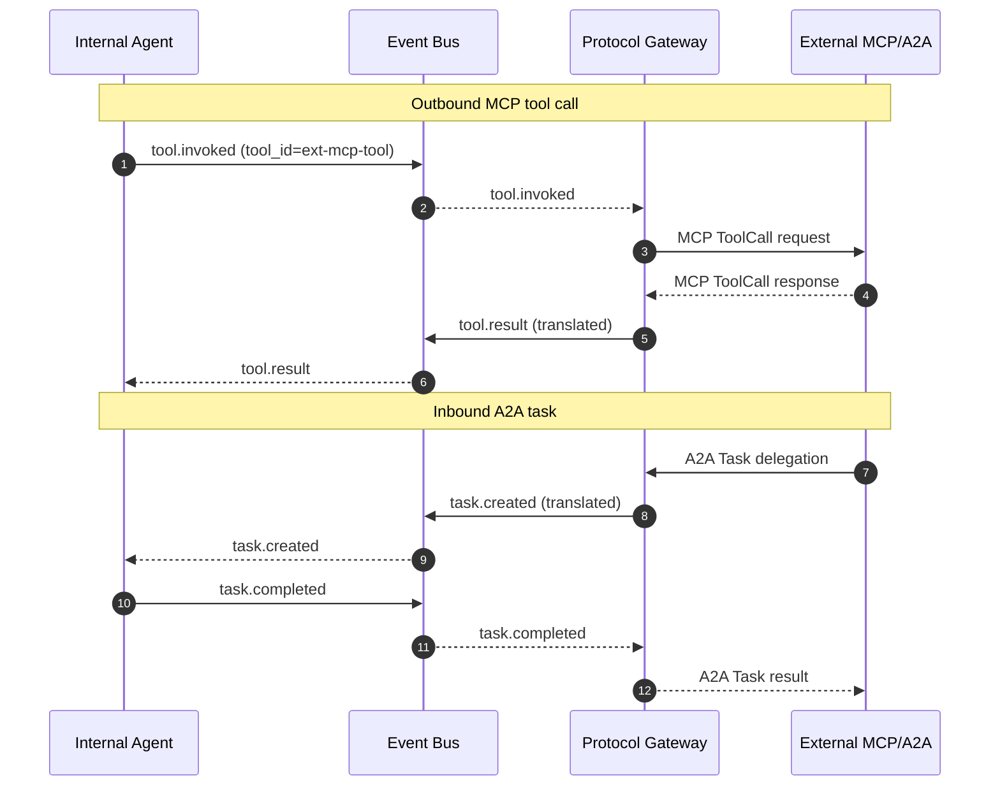

# Protocol wrappers for external agents (MCP/A2A/etc.)

## 1. Context and problem statement

The framework must interoperate with external agent ecosystems. Two emerging protocols are relevant:
1. **MCP (Model Context Protocol)**: a standard for exposing and consuming **tools** (functions, data sources) across agent systems.
2. **A2A (Agent-to-Agent protocol)**: a standard for **agent-level** interoperability — delegating tasks to external agents and receiving results.

The Protocol Gateway translates between these external protocols and our internal Event Bus envelope, keeping internal agents protocol-agnostic.

**Constraints:**
- Both protocols are evolving rapidly; the adapter layer must be easy to update.
- External agents/tools are untrusted by default; the gateway must enforce security (authZ, rate limits, input validation).
- External protocol calls add latency (network round-trip to external services).
- Must support both **inbound** (exposing our agents/tools to external consumers) and **outbound** (consuming external agents/tools).

## 2. Requirements coverage

| Requirement | Coverage |
|---|---|
| R10 — Protocol wrappers (MCP, A2A) | Core: defines the Protocol Gateway. |
| R5 — Async with streaming | External protocol calls must support streaming where the protocol allows. |
| R8 — Trajectory capture | Protocol events (`protocol.mcp.*`, `protocol.a2a.*`) are recorded. |

## 3. Options

### Option A — Embed protocol handling in each agent

Each agent that needs to consume external tools/agents implements protocol handling directly.

**Pros:**
- No additional service.

**Cons:**
- Protocol logic scattered across agents; inconsistent implementations.
- Security enforcement is per-agent (no centralized policy).
- Protocol updates require changing every affected agent.

### Option B — Centralized Protocol Gateway service (recommended)

A dedicated service that:
1. **Outbound MCP**: Registers external MCP tool servers. When an agent invokes a tool that is backed by an MCP server, the Tool Gateway routes through the Protocol Gateway, which translates the internal tool invocation into an MCP request.
2. **Inbound MCP**: Exposes selected internal tools as MCP servers for external consumers.
3. **Outbound A2A**: When a coordinator wants to delegate to an external agent, it publishes a `protocol.a2a.request` event. The Protocol Gateway translates this into an A2A task delegation.
4. **Inbound A2A**: Exposes selected internal agents as A2A-compatible endpoints.

**Pros:**
- Single point of protocol translation; easy to update when protocols evolve.
- Centralized security (authZ, rate limits, input validation for external calls).
- Internal agents remain protocol-agnostic; they interact only with the Event Bus.

**Cons:**
- Additional service to operate.
- Single point of failure for protocol interactions (mitigated by replication).

### Option C — Sidecar protocol adapters

Each agent pod runs a sidecar that handles protocol translation.

**Pros:**
- Distributed; no central gateway bottleneck.

**Cons:**
- Sidecar update requires bouncing all pods.
- Harder to enforce centralized security policies.
- More resource overhead (one sidecar per agent pod).

## 4. Decision drivers

| Driver | Weight | Favors |
|---|---|---|
| Protocol evolution agility | High | Centralized gateway (Option B) |
| Security enforcement | High | Centralized gateway (Option B) |
| Internal agent simplicity | High | Centralized gateway (Option B) |
| Operational overhead | Medium | Sidecar (Option C) has less latency but more complexity |

## 5. Recommendation

**Recommended: Option B — Centralized Protocol Gateway**

**MCP integration architecture:**

| Direction | Flow |
|---|---|
| **Outbound** | Agent → Tool Gateway → Protocol Gateway → External MCP Server |
| **Inbound** | External MCP Client → Protocol Gateway → Event Bus → Agent → Protocol Gateway → External MCP Client |

**A2A integration architecture:**

| Direction | Flow |
|---|---|
| **Outbound** | Coordinator → `protocol.a2a.request` event → Protocol Gateway → External A2A Agent → Protocol Gateway → `protocol.a2a.response` event → Coordinator |
| **Inbound** | External A2A Client → Protocol Gateway → `task.created` event → Agent → `task.completed` event → Protocol Gateway → External A2A Client |

**Protocol adapter design:**

```python
class ProtocolAdapter(ABC):
    """Base class for protocol adapters (MCP, A2A, future protocols)."""

    @abstractmethod
    async def translate_outbound(self, internal_event: EventEnvelope) -> ExternalRequest: ...

    @abstractmethod
    async def translate_inbound(self, external_request: ExternalRequest) -> EventEnvelope: ...

    @abstractmethod
    async def translate_response(self, external_response: ExternalResponse) -> EventEnvelope: ...


class MCPAdapter(ProtocolAdapter):
    """Translates between internal tool invocations and MCP protocol."""
    ...

class A2AAdapter(ProtocolAdapter):
    """Translates between internal task events and A2A protocol."""
    ...
```

**Security for external protocol calls:**
| Concern | Mitigation |
|---|---|
| External MCP server is malicious | Response sanitization; timeout enforcement; no execution of arbitrary code from external tools. |
| External A2A agent is unreliable | Timeout + circuit breaker; fallback to internal agent if available. |
| Inbound requests from untrusted clients | API key / OAuth2 authentication at the Protocol Gateway ingress; rate limiting per client. |
| Data leakage via protocol calls | PII stripping before outbound calls; external responses are validated before injection into the Event Bus. |

**Risks / mitigations:**
| Risk | Mitigation |
|---|---|
| Protocol spec changes break adapters | Adapters are thin and versioned; protocol version negotiation at connection time. |
| Protocol Gateway is a bottleneck | Stateless; horizontally scaled. Protocol calls are relatively rare compared to internal agent-to-agent events. |
| MCP/A2A adoption is uncertain | Build adapters only when there are concrete external integrations; delay until Phase 3. |

## 6. Required ADRs

- [ADR-0008: Protocol Gateway for MCP/A2A](../adr/ADR-0008-protocol-gateway-mcp-a2a.md) — this decision.

## 7. Diagrams



## 8. References

- MCP (Model Context Protocol): [Specification](https://modelcontextprotocol.io/) — defines tool and resource exposure.
- A2A (Agent-to-Agent): emerging protocol specifications for agent interoperability.
- Google Cloud: [Choose your agentic AI architecture components](https://docs.cloud.google.com/architecture/choose-agentic-ai-architecture-components) — interoperability patterns.
