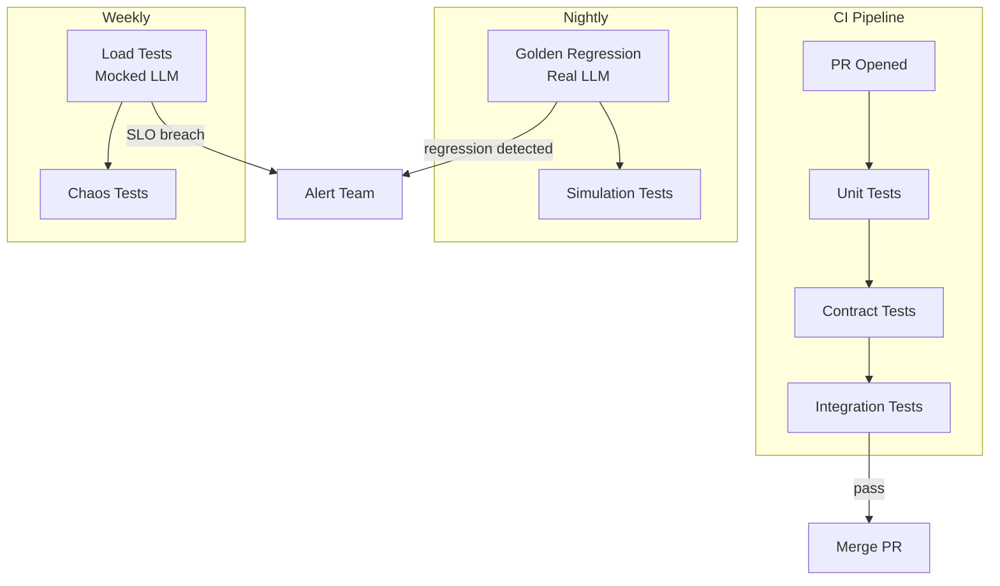

# Testing strategy: simulation, contract tests, load, chaos

## 1. Context and problem statement

Multi-agent systems are difficult to test because:
- Agent behavior is **non-deterministic** (LLM outputs vary).
- End-to-end tests require **multiple agents** running concurrently with access to the Event Bus, Shared Memory, and external tools.
- Failures may be **emergent** (individual agents work fine; the swarm fails due to interaction patterns).
- Performance under load is unpredictable (LLM rate limits, cascading delays).

The testing strategy must cover:
1. **Unit tests**: individual agent logic (mocked LLM, mocked tools).
2. **Contract tests**: agent-to-agent message schema conformance.
3. **Integration tests**: agent + Event Bus + Shared Memory.
4. **Regression tests**: golden trajectory replay with evaluation scoring.
5. **Load tests**: throughput and latency under production-scale traffic.
6. **Chaos tests**: resilience when agents crash, the Event Bus lags, or LLMs time out.

**Constraints:**
- LLM calls are expensive; tests that invoke real LLMs must be budgeted.
- Tests must run in CI (GitHub Actions, GitLab CI, or equivalent).
- Non-determinism requires statistical assertions (e.g., "relevance score > 0.7 in 90% of runs").

## 2. Requirements coverage

| Requirement | Coverage |
|---|---|
| R1 — Production-ready | Testing is a production gate. |
| R9 — Automated prompt runs | Regression tests exercise prompt changes. |
| R8 — Trajectory capture/replay | Replay engine powers regression tests. |

## 3. Options

### Option A — Manual testing only

**Pros:** None meaningful for production systems.

**Cons:** Unacceptable for enterprise e-commerce. Non-repeatable, slow, error-prone.

### Option B — Comprehensive automated testing pyramid (recommended)

Build a testing framework that covers all levels of the pyramid with appropriate tooling:

| Test level | What | How | LLM cost |
|---|---|---|---|
| **Unit** | Individual agent `handle()` logic. | Mock LLM responses, mock tool responses, mock Event Bus. Use `pytest` + `pytest-asyncio`. | Zero (mocked). |
| **Contract** | Message schema conformance. | Validate that each agent's published events match the registered JSON Schema. Use `schemathesis` or custom validators. | Zero. |
| **Integration** | Agent + real Event Bus (NATS JetStream) + real Redis. | Docker Compose test environment. Real agent processing with mocked LLM. | Zero (mocked). |
| **Regression (golden)** | Prompt quality. | Replay golden inputs through agents with real LLM. Evaluate outputs with Evaluation Layer. Compare to baseline. | Moderate (LLM calls on golden set). |
| **Load** | Throughput, latency, stability. | Locust or k6 generating synthetic user sessions. Agents run with mocked LLM (configurable latency). | Zero (mocked) or low (with real LLM subset). |
| **Chaos** | Resilience. | Litmus or custom chaos injectors: kill agent pods, introduce NATS delays, simulate LLM 429s. | Zero (mocked). |
| **Simulation** | Emergent swarm behavior. | Multi-agent simulation with scripted agent behaviors (deterministic). Validate convergence and message counts. | Zero (scripted). |

**Pros:**
- Comprehensive coverage across all failure modes.
- Cost-efficient: most tests use mocked LLMs.
- CI-friendly: unit/contract/integration run on every PR; regression nightly; load/chaos weekly.

**Cons:**
- Significant upfront investment to build the testing framework.
- Mocked LLM may not catch LLM-specific regressions (mitigated by golden regression tests).

## 4. Decision drivers

| Driver | Weight | Favors |
|---|---|---|
| Confidence for production deployment | High | Comprehensive pyramid (Option B) |
| CI pipeline speed | High | Mocked tests (most of Option B) |
| Cost control | High | Mocked LLM for most tests |
| Emergent behavior testing | Medium | Simulation tests (Option B) |

## 5. Recommendation

**Recommended: Option B — Comprehensive automated testing pyramid**

**Test environment architecture:**

```
CI environment (Docker Compose):
  - NATS JetStream (single node, ephemeral)
  - Redis (single node, ephemeral)
  - PostgreSQL (single node, ephemeral)
  - Agent under test (with mocked or real LLM)
  - Test harness (publishes events, asserts on results)
```

**Mock LLM service:**
A lightweight HTTP service that returns pre-recorded LLM responses based on input fingerprints. Used for unit, integration, load, and chaos tests.

```python
class MockLLM:
    def __init__(self, responses: dict[str, str]):
        self.responses = responses  # input_fingerprint → response

    async def complete(self, prompt: str) -> str:
        fingerprint = hashlib.sha256(prompt.encode()).hexdigest()[:16]
        return self.responses.get(fingerprint, "Default mock response")
```

**Golden regression test structure:**

```
tests/golden/
  product-search-agent/
    test_001_basic_search.json
    test_002_filter_by_price.json
    test_003_out_of_stock.json
  coordinator-agent/
    test_001_simple_flow.json
    test_002_swarm_delegation.json
```

Each golden test file:
```json
{
  "test_id": "test_001_basic_search",
  "input_event": { ... },
  "expected_trajectory": [ ... ],
  "eval_criteria": {
    "relevance": { "threshold": 0.7, "tolerance": 0.1 },
    "factuality": { "threshold": 0.8 }
  },
  "baseline_scores": {
    "relevance": 0.85,
    "factuality": 0.92
  }
}
```

**CI pipeline stages:**

```
PR opened:
  1. Unit tests (< 2 min)
  2. Contract tests (< 1 min)
  3. Integration tests (< 5 min, Docker Compose)
  4. Prompt schema validation (< 1 min)

Nightly:
  5. Golden regression tests (real LLM, ~30 min, budgeted)
  6. Simulation tests (scripted agents, ~10 min)

Weekly:
  7. Load tests (mocked LLM, ~15 min)
  8. Chaos tests (mocked LLM, ~20 min)
```

**Risks / mitigations:**
| Risk | Mitigation |
|---|---|
| Golden tests become stale | Quarterly refresh; new production trajectories are candidates for golden tests. |
| LLM mock diverges from real LLM behavior | Golden regression tests (with real LLM) catch divergences. |
| Load tests don't reflect real traffic patterns | Use production traffic profiles (sanitized) as load test input. |
| Chaos tests are flaky | Chaos scenarios are deterministic (scripted failures, not random). Retry flaky scenarios 3x. |

## 6. Required ADRs

- Testing strategy is cross-cutting; no dedicated ADR. Relevant:
  - [ADR-0007: Observability and replay](../adr/ADR-0007-observability-replay.md) — replay engine powers regression tests.
  - [ADR-0006: Evaluation and guardrails](../adr/ADR-0006-evaluation-guardrails.md) — evaluation metrics used in regression scoring.

## 7. Diagrams



## 8. References

- Google Cloud: [Choose a design pattern for your agentic AI system](https://docs.cloud.google.com/architecture/choose-design-pattern-agentic-ai-system) — testing multi-agent systems.
