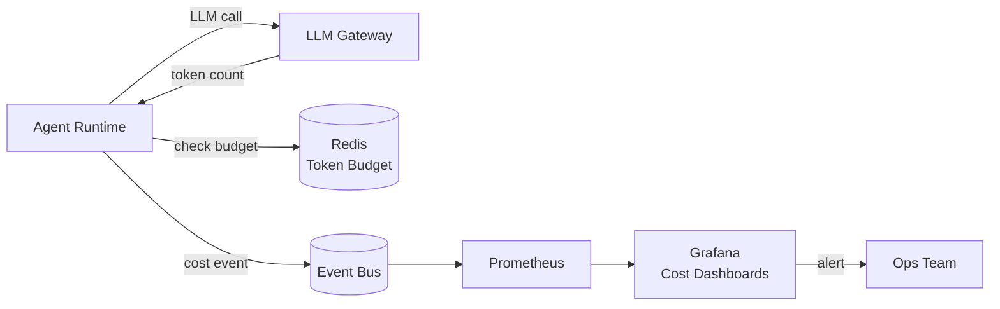

# Cost, latency budgets, SLOs, and capacity planning

## 1. Context and problem statement

Multi-agent systems amplify both **cost** and **latency** compared to single-agent designs. Each agent invocation incurs LLM token charges, and latency compounds as events traverse the bus and multiple agents process sequentially.

The framework needs:
1. **SLO definitions** for user-facing latency, throughput, and availability.
2. **Token budget enforcement** to prevent cost overruns.
3. **Latency budgets** that allocate time slices to each agent in a workflow.
4. **Cost attribution** to identify which agents, tenants, and workflows drive cost.
5. **Capacity planning** models for infrastructure sizing.

**Constraints:**
- E-commerce SLA: chatbot responses must feel interactive (p95 < 5s for common workflows).
- LLM costs are dominant (>70% of total cost in a typical agentic system).
- Flash-sale traffic requires pre-scaling; organic traffic follows diurnal patterns.
- Must support per-tenant cost tracking and billing attribution.

## 2. Requirements coverage

| Requirement | Coverage |
|---|---|
| R1 — Production-ready | SLOs and capacity planning are production prerequisites. |
| R3 — Horizontal scaling | Capacity planning ensures scaling targets are met. |

## 3. Options

### Option A — No explicit cost/latency controls

Let agents run unconstrained; monitor after the fact.

**Pros:**
- Simplest implementation.

**Cons:**
- Cost overruns on complex workflows (swarm delegation with no budget).
- Latency violations for edge cases (agent chains that go deep).
- No per-tenant fairness.

### Option B — Framework-enforced budgets and SLOs (recommended)

Build cost and latency controls into the Agent Runtime and Event Bus:

| Control | Mechanism |
|---|---|
| **Session token budget** | Coordinator declares a max token budget for the session. Agent Runtime tracks cumulative tokens. When budget is exhausted, remaining agents receive a "budget_exceeded" signal and must return best-effort results without additional LLM calls. |
| **Per-agent latency budget** | Coordinator allocates a time slice to each sub-task. Agent Runtime enforces the timeout. |
| **Swarm delegation budget** | Coordinator sets (max_tokens, max_turns, timeout) for swarm delegations. |
| **Per-tenant rate limit** | Event Bus enforces a per-tenant publish rate limit (events/second). LLM Gateway enforces a per-tenant token-per-minute limit. |
| **Cost attribution** | Every LLM call records (model, input_tokens, output_tokens, cost_usd, agent_id, session_id, tenant_id). Aggregated in Grafana dashboards. |

## 4. Decision drivers

| Driver | Weight | Favors |
|---|---|---|
| Cost predictability | High | Framework-enforced budgets (Option B) |
| Latency guarantees | High | Latency budgets (Option B) |
| Tenant fairness | High | Per-tenant rate limits (Option B) |
| Operational complexity | Medium | Option B (more controls to configure) |

## 5. Recommendation

**Recommended: Option B — Framework-enforced budgets and SLOs**

**SLO definitions:**

| SLO | Target | Measurement |
|---|---|---|
| **User-facing latency (simple query)** | p50 < 2s, p95 < 5s | Time from user message to first response chunk. |
| **User-facing latency (complex workflow)** | p50 < 5s, p95 < 15s | Time from user message to final response. |
| **Agent availability** | 99.9% | Percentage of time agents pass health checks. |
| **Event Bus availability** | 99.99% | NATS JetStream cluster uptime. |
| **Evaluation latency** | p95 < 500ms | Time for evaluation pipeline to pass/fail a response. |
| **Trajectory Store write latency** | p95 < 50ms | Time to durably store an event. |

**Latency budget allocation (example: product search workflow):**

| Step | Agent | Budget | Typical |
|---|---|---|---|
| 1 | Coordinator (route) | 200ms | 100ms |
| 2 | Product Search Agent (LLM + tool) | 3000ms | 1500ms |
| 3 | Product Enrichment Agent | 1000ms | 500ms |
| 4 | Coordinator (synthesize) | 500ms | 300ms |
| 5 | Evaluation Layer | 300ms | 150ms |
| **Total** | | **5000ms** | **2550ms** |

**Token budget enforcement:**

```python
class TokenBudget:
    def __init__(self, max_tokens: int):
        self.max_tokens = max_tokens
        self.used_tokens = 0

    def consume(self, tokens: int) -> bool:
        """Returns False if budget would be exceeded."""
        if self.used_tokens + tokens > self.max_tokens:
            return False
        self.used_tokens += tokens
        return True

    @property
    def remaining(self) -> int:
        return max(0, self.max_tokens - self.used_tokens)
```

Token budget is stored in session memory (Redis) and checked by the Agent Runtime before each LLM call. Budget state is propagated in the event envelope metadata.

**Cost attribution pipeline:**

```
LLM call → Agent Runtime records:
  {model, input_tokens, output_tokens, cost_usd, agent_id, session_id, tenant_id}
  → Published as system.cost event to Event Bus
  → Aggregated in Prometheus counter metrics
  → Visualized in Grafana per (agent, tenant, day)
```

**Capacity planning model:**

| Parameter | Baseline | Flash sale (10x) |
|---|---|---|
| Concurrent sessions | 500 | 5,000 |
| Events/sec (Event Bus) | 1,000 | 10,000 |
| LLM calls/sec | 200 | 2,000 |
| Agent pods (product search) | 5 | 50 |
| Redis connections | 100 | 1,000 |
| PostgreSQL connections | 50 | 500 |

**Scaling triggers:**
- Agent pods: HPA on NATS pending message count > 50/consumer.
- Redis: monitor memory; alert at 80% capacity.
- PostgreSQL: connection pooling via PgBouncer; alert on connection saturation.

**Risks / mitigations:**
| Risk | Mitigation |
|---|---|
| Token budget too aggressive → poor response quality | Configurable per workflow; start generous, tighten based on data. |
| Latency budget violated by LLM variability | Budget includes buffer (50%); circuit breaker returns cached/degraded response if budget is exceeded. |
| Cost dashboards lag behind reality | Real-time cost telemetry via event-driven pipeline (not batch). Alert thresholds per tenant. |
| Flash-sale pre-scaling is wrong | Pre-scaling is based on traffic forecasts + 50% buffer. KEDA scales reactively for unanticipated spikes. |

## 6. Required ADRs

- Cost and SLO decisions are cross-cutting. Most directly:
  - [ADR-0009: Deployment and scaling](../adr/ADR-0009-deployment-scaling-isolation.md) — scaling triggers.
  - [ADR-0003: Agent Runtime](../adr/ADR-0003-agent-runtime-model.md) — timeout and retry policies.

## 7. Diagrams



## 8. References

- Google Cloud: [Choose your agentic AI architecture components](https://docs.cloud.google.com/architecture/choose-agentic-ai-architecture-components) — SLO and latency management.
- Confluent: [Event-Driven Multi-Agent Systems](https://www.confluent.io/blog/event-driven-multi-agent-systems/) — cost and throughput considerations.
