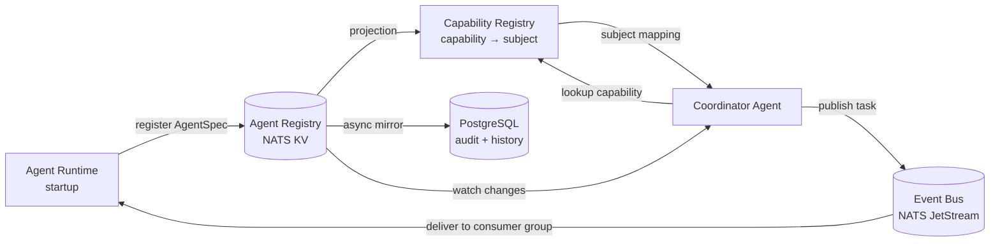
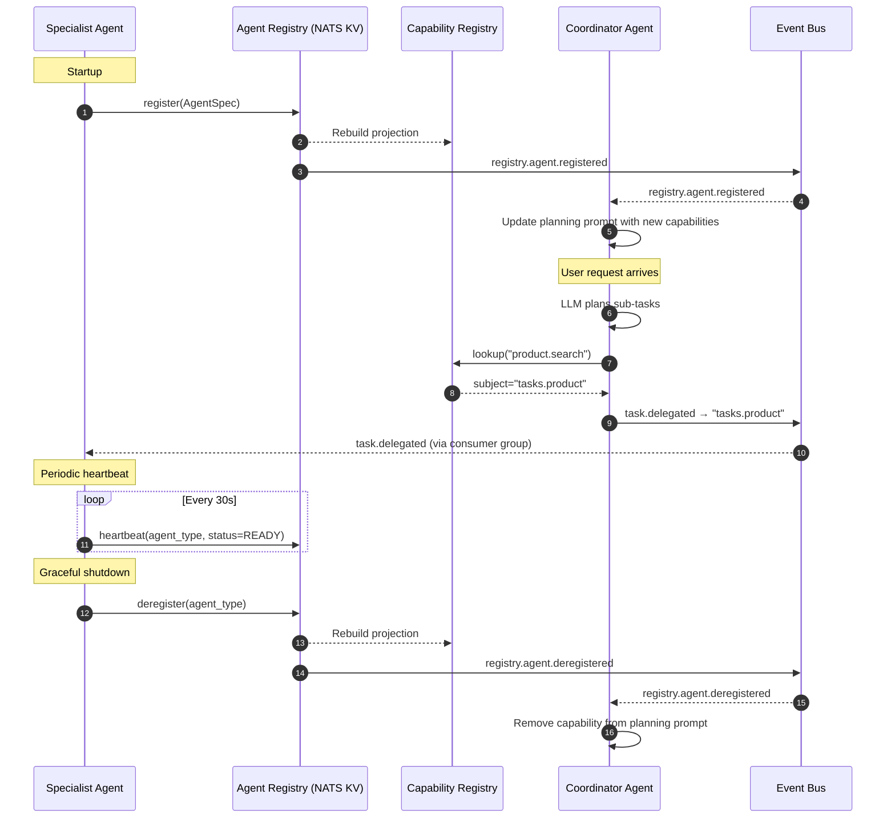

# Agent Registry, AgentSpec, and capability-based discovery

Sources: [high_level_architecture.md](../high_level_architecture.md), [reading_list.md](../references/reading_list.md)

## 1. Context and problem statement

The framework requires a mechanism for agents to declare their capabilities, for the Coordinator to discover and route tasks to the correct specialist, and for the platform to manage agent lifecycle metadata. Without a formal registry and specification format, agent routing becomes hard-coded, fragile, and impossible to scale.

**Constraints:**
- Agents are deployed as independent Kubernetes Deployments; registration must be dynamic.
- The Coordinator must not hard-code specialist agent references.
- Capabilities must be machine-readable for LLM-driven task planning.
- The registry must support hot-reload (new agents register without platform restart).
- Multi-tenancy: some agents may be tenant-specific; the registry must support scoping.

## 2. Requirements coverage

| Requirement | Coverage |
|---|---|
| R1 — Production-ready | Registry must be highly available and consistent. |
| R2 — Easy agent composition | AgentSpec makes adding a new agent a declarative act. |
| R3 — Horizontal scaling | Multiple replicas share the same AgentSpec; consumer groups handle load balancing. |
| R4 — Multiple communication patterns | AgentSpec declares which patterns the agent supports (coordinator-managed, swarm, bidding). |
| R10 — Protocol wrappers | External agents exposed via Protocol Gateway also have AgentSpec entries. |

## 3. AgentSpec entity

The **AgentSpec** is the canonical declarative document that fully describes an agent. Every agent — internal or external — must have an AgentSpec registered in the Agent Registry before it can participate in the platform.

### 3.1 AgentSpec schema (Pydantic model)

```python
from pydantic import BaseModel, Field
from enum import Enum
from datetime import datetime


class CommunicationPattern(str, Enum):
    COORDINATOR_MANAGED = "coordinator_managed"
    SWARM_PEER = "swarm_peer"
    BLACKBOARD = "blackboard"
    MARKET_BIDDING = "market_bidding"


class AgentCapability(BaseModel):
    """A discrete ability an agent declares it can perform."""
    name: str = Field(
        ...,
        description="Unique capability identifier, e.g., 'product.search', 'order.cancel'",
        examples=["product.search", "product.compare", "order.status", "order.cancel"]
    )
    description: str = Field(
        ...,
        description="Human-readable description used in Coordinator LLM prompts for tool/task selection"
    )
    input_schema: dict = Field(
        ...,
        description="JSON Schema describing the expected input payload for this capability"
    )
    output_schema: dict = Field(
        ...,
        description="JSON Schema describing the output payload for this capability"
    )
    confidence_hint: float | None = Field(
        default=None,
        ge=0.0, le=1.0,
        description="Optional static confidence score (0–1) for market-based bidding"
    )


class AgentStatus(str, Enum):
    REGISTERED = "registered"
    READY = "ready"
    DRAINING = "draining"
    DEREGISTERED = "deregistered"


class AgentSpec(BaseModel):
    """
    Declarative document that fully describes an agent.
    Stored in the Agent Registry (NATS KV bucket or Redis hash).
    """
    # --- Identity ---
    agent_type: str = Field(
        ...,
        description="Unique agent type identifier, e.g., 'product-search-agent'",
        examples=["product-search-agent", "order-tracking-agent", "coordinator-agent"]
    )
    version: str = Field(
        ...,
        description="Semantic version of this agent, e.g., '1.3.0'",
        pattern=r"^\d+\.\d+\.\d+$"
    )

    # --- Capabilities ---
    capabilities: list[AgentCapability] = Field(
        ...,
        min_length=1,
        description="List of discrete capabilities this agent provides"
    )

    # --- Routing ---
    nats_subject: str = Field(
        ...,
        description="NATS JetStream subject this agent consumes from, e.g., 'tasks.product'",
        examples=["tasks.product", "tasks.order", "tasks.coordinator"]
    )
    consumer_group: str = Field(
        ...,
        description="NATS JetStream consumer group for load balancing across replicas",
        examples=["product-search-agent-group"]
    )
    supported_patterns: list[CommunicationPattern] = Field(
        default=[CommunicationPattern.COORDINATOR_MANAGED],
        description="Communication patterns this agent can participate in"
    )

    # --- Runtime configuration ---
    max_concurrent_tasks: int = Field(
        default=10,
        ge=1,
        description="Maximum concurrent tasks per agent instance"
    )
    task_timeout_ms: int = Field(
        default=60_000,
        ge=1000,
        description="Per-task timeout in milliseconds"
    )
    llm_timeout_ms: int = Field(
        default=30_000,
        ge=1000,
        description="Per-LLM-call timeout in milliseconds"
    )
    max_retries: int = Field(
        default=3,
        ge=0,
        description="Maximum retry attempts for transient failures"
    )
    reflection_config: "ReflectionConfig | None" = Field(
        default=None,
        description="Optional reflection loop configuration"
    )

    # --- Evaluation ---
    evaluators: list[str] = Field(
        default=[],
        description="List of evaluator names to apply to this agent's outputs",
        examples=[["no_pii", "relevance", "factuality"]]
    )

    # --- Tools ---
    tools: list[str] = Field(
        default=[],
        description="List of tool_ids this agent is authorized to invoke via the Tool Gateway",
        examples=[["product-catalog.search", "product-catalog.details", "cart.add"]]
    )

    # --- Ownership & metadata ---
    owner_team: str = Field(
        ...,
        description="Team responsible for this agent",
        examples=["shopping-experience", "order-management"]
    )
    tenant_scope: str | None = Field(
        default=None,
        description="If set, this agent is scoped to a specific tenant. None = shared across tenants."
    )
    description: str = Field(
        ...,
        description="Human-readable description of this agent's purpose"
    )
    tags: dict[str, str] = Field(
        default={},
        description="Arbitrary key-value metadata tags"
    )

    # --- Lifecycle ---
    status: AgentStatus = Field(
        default=AgentStatus.REGISTERED,
        description="Current lifecycle status"
    )
    registered_at: datetime = Field(
        default_factory=datetime.utcnow,
        description="Timestamp when this agent registered"
    )
    last_heartbeat: datetime | None = Field(
        default=None,
        description="Timestamp of last heartbeat from a running instance"
    )


class ReflectionConfig(BaseModel):
    """Configuration for the optional reflection loop."""
    enabled: bool = True
    max_rounds: int = Field(default=2, ge=1, le=5)
    criteria: list[str] = Field(
        default=["completeness", "accuracy"],
        description="Evaluation criteria for the reflection LLM"
    )
    model: str = Field(
        default="gpt-4o-mini",
        description="LLM model used for reflection evaluation"
    )
```

### 3.2 Example AgentSpec instances

**Product Search Agent:**

```yaml
agent_type: product-search-agent
version: "1.2.0"
capabilities:
  - name: product.search
    description: "Search the product catalog by keyword, category, price range, and attributes"
    input_schema:
      type: object
      properties:
        query: { type: string }
        category: { type: string }
        price_min: { type: number }
        price_max: { type: number }
        filters: { type: object }
      required: [query]
    output_schema:
      type: object
      properties:
        results: { type: array, items: { "$ref": "#/defs/ProductSummary" } }
        total_count: { type: integer }
  - name: product.compare
    description: "Compare two or more products across attributes (price, features, reviews)"
    input_schema:
      type: object
      properties:
        product_ids: { type: array, items: { type: string }, minItems: 2 }
      required: [product_ids]
    output_schema:
      type: object
      properties:
        comparison_table: { type: object }

nats_subject: tasks.product
consumer_group: product-search-agent-group
supported_patterns: [coordinator_managed, market_bidding]

max_concurrent_tasks: 10
task_timeout_ms: 60000
llm_timeout_ms: 30000
max_retries: 3
reflection_config:
  enabled: true
  max_rounds: 2
  criteria: [relevance, completeness]
  model: gpt-4o-mini

evaluators: [no_pii, relevance, factuality]
tools: [product-catalog.search, product-catalog.details, product-catalog.compare]

owner_team: shopping-experience
tenant_scope: null
description: "Handles product search and comparison queries using the product catalog"
tags:
  tier: "core"
  domain: "catalog"
```

**Coordinator Agent:**

```yaml
agent_type: coordinator-agent
version: "1.0.0"
capabilities:
  - name: session.orchestrate
    description: "Receive user requests, decompose into sub-tasks, delegate to specialists, and synthesize responses"
    input_schema:
      type: object
      properties:
        user_message: { type: string }
        session_context: { type: object }
      required: [user_message]
    output_schema:
      type: object
      properties:
        response: { type: string }
        delegated_tasks: { type: array }

nats_subject: tasks.coordinator
consumer_group: coordinator-agent-group
supported_patterns: [coordinator_managed]

max_concurrent_tasks: 20
task_timeout_ms: 120000
llm_timeout_ms: 30000
max_retries: 2

evaluators: [no_pii, coherence, brand_voice]
tools: [all]

owner_team: platform
tenant_scope: null
description: "Central coordinator that plans, delegates, and synthesizes multi-agent workflows"
tags:
  tier: "platform"
  critical: "true"
```

## 4. Agent Registry

### 4.1 Storage backend

| Option | Pros | Cons | Recommendation |
|---|---|---|---|
| **NATS JetStream KV bucket** | Native to the Event Bus; watch API for change notifications; built-in replication. | Limited query capabilities; no SQL. | **Primary** — for runtime discovery. |
| **Redis hash** | Sub-ms reads; familiar to the team. | No built-in change notifications (need pub/sub layer). | **Alternative** — if NATS KV is insufficient. |
| **PostgreSQL** | Rich queries; durable. | Higher latency for hot-path lookups. | **Audit mirror** — for historical queries. |

**Recommended:** NATS JetStream KV bucket as the primary registry, with an async mirror to PostgreSQL for audit and historical queries.

### 4.2 Registry operations

| Operation | Description | Trigger |
|---|---|---|
| `register(spec)` | Agent writes its AgentSpec to the KV bucket | Agent startup (`INITIALIZING` → `READY`) |
| `deregister(agent_type)` | Agent removes its AgentSpec | Graceful shutdown (`DRAINING` → `STOPPED`) |
| `heartbeat(agent_type)` | Agent updates `last_heartbeat` and `status` | Periodic (every 30s) |
| `lookup(capability)` | Query the Capability Registry projection | Coordinator task planning |
| `list_agents()` | List all registered AgentSpecs | Admin/monitoring dashboards |
| `watch(prefix)` | Subscribe to AgentSpec changes | Coordinator prompt regeneration |

### 4.3 Capability Registry (projection)

The **Capability Registry** is a derived, read-only view built from all registered AgentSpecs:

```python
# Built from all AgentSpecs in the Agent Registry
capability_registry: dict[str, CapabilityMapping] = {
    "product.search": CapabilityMapping(
        capability="product.search",
        agent_type="product-search-agent",
        nats_subject="tasks.product",
        description="Search the product catalog by keyword, category, price range, and attributes",
        input_schema={...},
    ),
    "product.compare": CapabilityMapping(
        capability="product.compare",
        agent_type="product-search-agent",
        nats_subject="tasks.product",
        description="Compare two or more products across attributes",
        input_schema={...},
    ),
    "order.status": CapabilityMapping(
        capability="order.status",
        agent_type="order-tracking-agent",
        nats_subject="tasks.order",
        description="Check the current status of an order",
        input_schema={...},
    ),
    # ...
}
```

The Coordinator Agent uses this projection to:
1. Build its planning prompt (capability names + descriptions).
2. Resolve `target_capability` → `nats_subject` for task delegation.

### 4.4 Stale agent detection

If an agent fails to heartbeat for 3 consecutive intervals (90s default), the registry marks its status as `DEREGISTERED` and emits an `agent.deregistered` event. The Coordinator watches for these events to update its capability set.

## 5. Event taxonomy additions

New events for the Agent Registry:

| Event type | Description |
|---|---|
| `registry.agent.registered` | An agent registered its AgentSpec. |
| `registry.agent.deregistered` | An agent deregistered (graceful or stale detection). |
| `registry.agent.heartbeat` | Periodic heartbeat update. |
| `registry.capability.changed` | The Capability Registry projection changed (new capability, removed capability). |

## 6. Failure modes and mitigations

| Failure | Impact | Mitigation |
|---|---|---|
| NATS KV unavailable | Agents cannot register; Coordinator uses stale capability set. | NATS cluster replication (factor 3). Coordinator caches last-known capability set in memory. |
| Agent crashes without deregistering | Stale entry in registry. | Heartbeat-based eviction (3 missed heartbeats = auto-deregister). |
| Duplicate capability (two agents declare the same capability) | Ambiguous routing. | Registry rejects duplicate capabilities; or routes to the agent with higher `confidence_hint`. |
| Rolling update (old version deregisters, new version registers) | Brief capability gap. | Agent deregisters only after new version is READY (coordinated via Kubernetes rolling update strategy). |

## 7. Diagrams

### DataFlow



### Activity



## 8. Related ADRs

- [ADR-0010: Agent Registry and AgentSpec](../adr/ADR-0010-agent-registry-agentspec.md)
- [ADR-0001: Messaging Backbone](../adr/ADR-0001-messaging-backbone.md) — NATS JetStream (includes KV bucket)
- [ADR-0003: Agent Runtime Model](../adr/ADR-0003-agent-runtime-model.md) — runtime lifecycle includes registration

## 9. References

- A2A Protocol: Agent Card concept — analogous to AgentSpec for external-facing discovery.
- [design/diagrams/01_overview.md](../diagrams/01_overview.md) — task routing flow using the Capability Registry.
