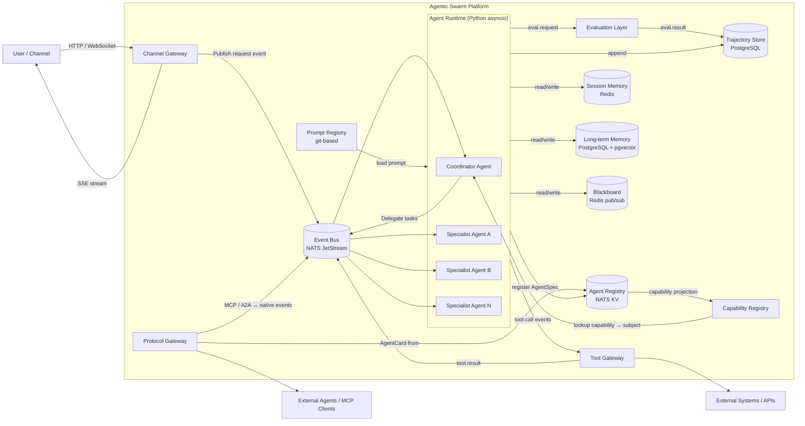
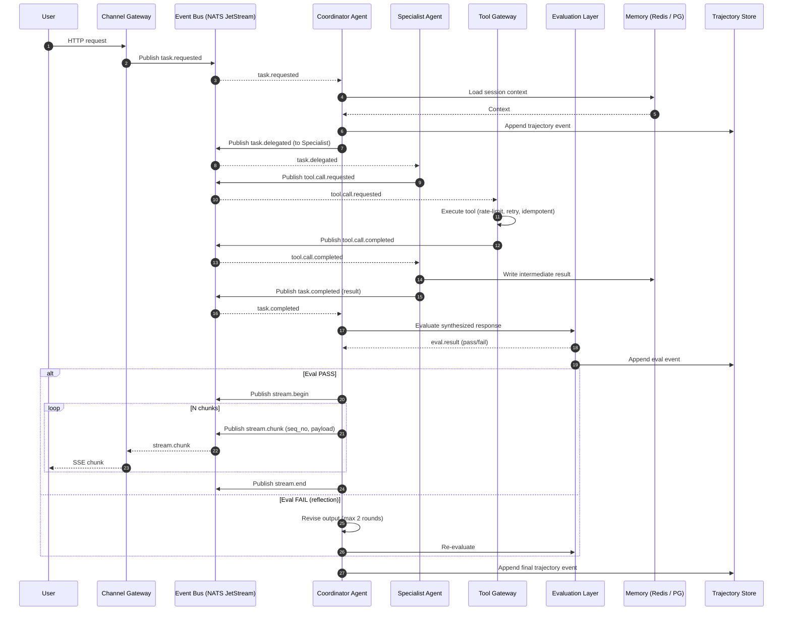
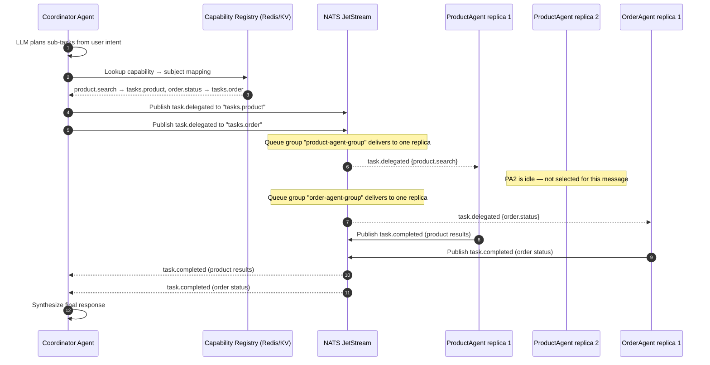

# Diagram: Architecture Overview

This topic is documented with two complementary views:
- **DataFlow** diagram (Mermaid `flowchart`) showing structural data movement.
- **Activity** diagram (Mermaid `sequenceDiagram`) showing message/event ordering for a typical request.

Sources: [high_level_architecture.md](../high_level_architecture.md), [reading_list.md](../references/reading_list.md)

## DataFlow



Notes:
- All inter-agent communication flows through the **Event Bus** (NATS JetStream pub/sub).
- The **Trajectory Store** captures every event for replay, audit, and evaluation.
- The **Protocol Gateway** translates MCP / A2A at the boundary; internal agents remain protocol-agnostic.
- The **Prompt Registry** is a git-based store loaded at agent startup; prompts are versioned and CI-tested.

## Activity

A typical end-to-end request flow through the platform:



## How task routing works — subjects, queues, and agent discovery

### Coordinator → Specialist: subject-based routing

The Coordinator Agent does **not** hard-code which specialist to call. Instead it uses a two-step process:

1. **Agent Registry and AgentSpec** — Every agent is fully described by an **AgentSpec** document that declares its `agent_type`, **capabilities** (the discrete tasks it can handle), `nats_subject`, input/output schemas, version, and owner team. At startup each Specialist Agent writes its AgentSpec into the **Agent Registry** (a NATS JetStream key-value bucket or Redis hash). On graceful shutdown it deregisters.

   The **Capability Registry** is a **read-only projection** of the Agent Registry — it maps each declared capability to the NATS subject of the agent that provides it. The Coordinator queries this projection to route tasks.

   Example AgentSpec entries (capability → subject view):

   | Agent type | Capabilities (from AgentSpec) | NATS subject |
   |---|---|---|
   | `ProductAgent` | `product.search`, `product.detail`, `product.compare` | `tasks.product` |
   | `OrderAgent` | `order.status`, `order.cancel`, `order.return` | `tasks.order` |
   | `RecommendationAgent` | `recommend.similar`, `recommend.personal` | `tasks.recommend` |
   | `SupportAgent` | `support.faq`, `support.escalate` | `tasks.support` |

2. **LLM-driven task planning** — When the Coordinator receives a user request, it calls its planning LLM with the user intent **plus** the Capability Registry (the capability → subject projection) as context. The LLM decomposes the request into one or more sub-tasks, each tagged with a `target_capability` (e.g., `product.search`). The Coordinator looks up which NATS subject handles that capability and publishes a `task.delegated` event to that subject.

   ```text
   User: "Find me a red winter jacket under $200 and check if my order #1234 has shipped"

   Coordinator LLM plans:
     Sub-task 1 → target_capability: product.search  → publish to: tasks.product
     Sub-task 2 → target_capability: order.status     → publish to: tasks.order
   ```

### Specialist picks up work: NATS JetStream queue groups

Each specialist agent type subscribes to its subject using a **NATS JetStream queue group** (also called a "consumer group"). This is the mechanism that makes an agent "know" there is a task it can pick up:

```text
   Subject: tasks.product
   Consumer group: product-agent-group
   ┌──────────────────────────────────────────────┐
   │  NATS JetStream stream: TASKS                │
   │  Subject filter: tasks.product               │
   │                                              │
   │  Pending messages:                           │
   │    msg-1  task.delegated {product.search}     │
   │    msg-2  task.delegated {product.compare}    │
   └──────────┬──────────────┬────────────────────┘
              │              │
        ┌─────▼─────┐ ┌─────▼─────┐
        │ ProductAgent│ │ ProductAgent│   ← multiple replicas
        │  replica 1  │ │  replica 2  │      in the same queue group
        └─────────────┘ └─────────────┘
```

Key mechanics:

- **Competing consumers**: When multiple replicas of the same agent type subscribe to the same queue group, NATS delivers each message to **exactly one** replica. This provides automatic load balancing — whichever replica is free picks up the next task.
- **Ack/Nak**: The agent must explicitly **ack** the message after processing. If it crashes or times out, NATS automatically **redelivers** the message to another replica (configurable `max_deliver` and `ack_wait`).
- **No polling**: Agents do not poll for work. NATS **pushes** messages to subscribers as they arrive. The agent's asyncio event loop awaits incoming messages — zero CPU when idle.
- **Independent scaling**: Because each agent type has its own subject and queue group, scaling `ProductAgent` to 10 replicas during a flash sale does not affect `OrderAgent` (which might stay at 2 replicas).

### Putting it together — full routing flow



### Swarm mode — broadcast instead of queue group

In swarm/leaderless mode, the Coordinator (or Dispatcher) publishes to a **broadcast subject** (e.g., `swarm.broadcast.{session_id}`) that all participating agents subscribe to **without** a queue group. Every agent receives every message, enabling peer-to-peer collaboration via the Blackboard. See [02_patterns.md](02_patterns.md) for the leaderless swarm diagram.
