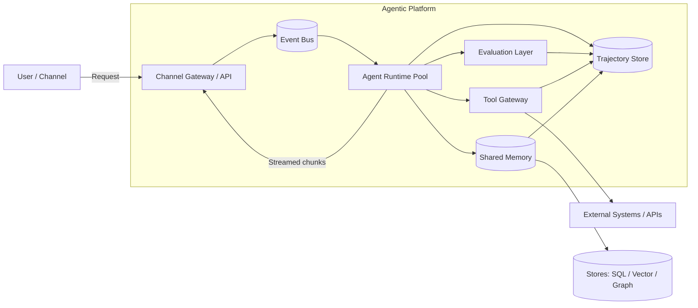

# Diagram: Architecture Overview

```mermaid
flowchart LR
  U[User / Channel] -->|Request| GW[Channel Gateway / API]

  subgraph Platform["Agentic Platform"]
    GW --> EB[(Event Bus)]
    EB --> AR[Agent Runtime Pool]
    AR --> TG[Tool Gateway]
    AR --> EV[Evaluation Layer]
    AR --> TS[(Trajectory Store)]
    AR --> SM[(Shared Memory)]
    EV --> TS
    TG --> TS
    SM --> TS
  end

  TG --> EXT[External Systems / APIs]
  SM --> DB[(Stores: SQL / Vector / Graph)]
  AR -->|Streamed chunks| GW
```

Notes:
- All inter-agent communication flows through the Event Bus (pub/sub).
- The Trajectory Store captures every event/message for replay and audit.
