# Diagram: Architecture Overview

This topic is documented with two complementary views:
- **DataFlow** diagram (Mermaid `flowchart`) showing structural data movement.
- **Activity** diagram (Mermaid `sequenceDiagram`) showing message/event ordering for a typical request.

Sources: [high_level_architecture.md](../high_level_architecture.md), [reading_list.md](../references/reading_list.md)

## DataFlow

```mermaid
flowchart LR
  U[User / Channel] -->|HTTP / WebSocket| CGW[Channel Gateway]

  subgraph Platform["Agentic Swarm Platform"]
    CGW -->|Publish request event| EB[(Event Bus\nNATS JetStream)]

    EB --> COORD[Coordinator Agent]
    COORD -->|Delegate tasks| EB
    EB --> SA1[Specialist Agent A]
    EB --> SA2[Specialist Agent B]
    EB --> SAN[Specialist Agent N]

    subgraph Runtime["Agent Runtime (Python asyncio)"]
      COORD
      SA1
      SA2
      SAN
    end

    Runtime -->|tool.call events| TG[Tool Gateway]
    Runtime -->|eval.request| EV[Evaluation Layer]
    Runtime -->|read/write| SM[(Session Memory\nRedis)]
    Runtime -->|read/write| LTM[(Long-term Memory\nPostgreSQL + pgvector)]
    Runtime -->|read/write| BB[(Blackboard\nRedis pub/sub)]
    Runtime -->|append| TS[(Trajectory Store\nPostgreSQL)]
    EV -->|eval.result| TS
    TG -->|tool.result| EB

    PR[Prompt Registry\ngit-based] -->|load prompt| Runtime

    PGW[Protocol Gateway] -->|MCP / A2A ↔ native events| EB
  end

  TG --> EXT[External Systems / APIs]
  PGW --> EXTAG[External Agents / MCP Clients]
  CGW -->|SSE stream| U
```

Notes:
- All inter-agent communication flows through the **Event Bus** (NATS JetStream pub/sub).
- The **Trajectory Store** captures every event for replay, audit, and evaluation.
- The **Protocol Gateway** translates MCP / A2A at the boundary; internal agents remain protocol-agnostic.
- The **Prompt Registry** is a git-based store loaded at agent startup; prompts are versioned and CI-tested.

## Activity

A typical end-to-end request flow through the platform:

