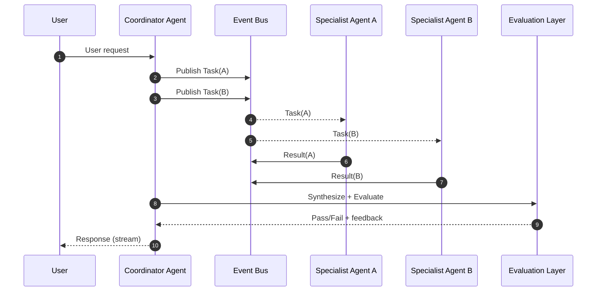
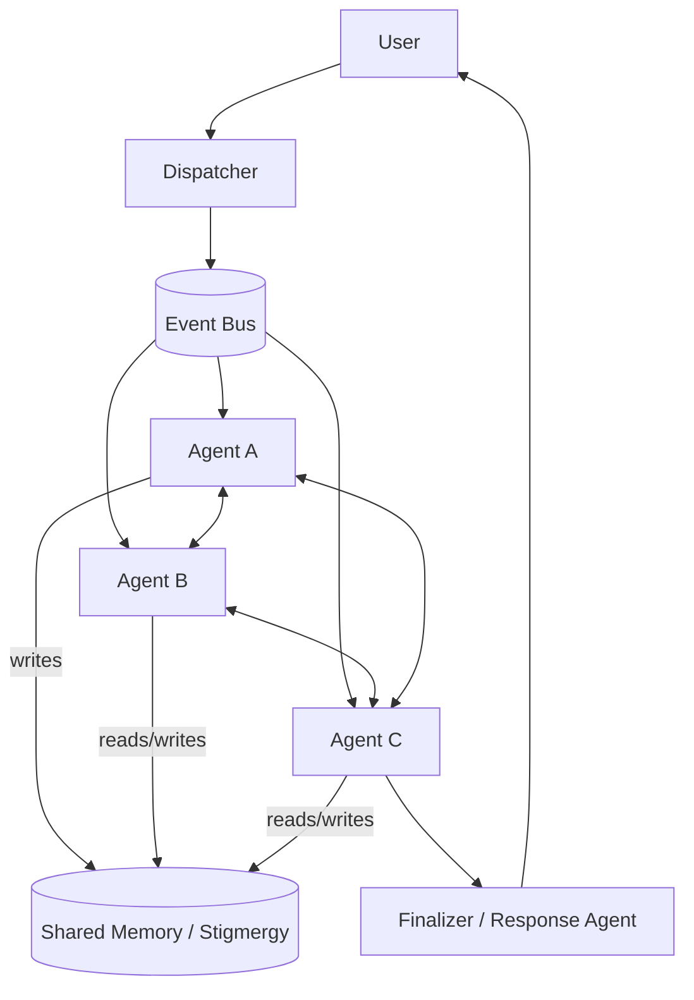
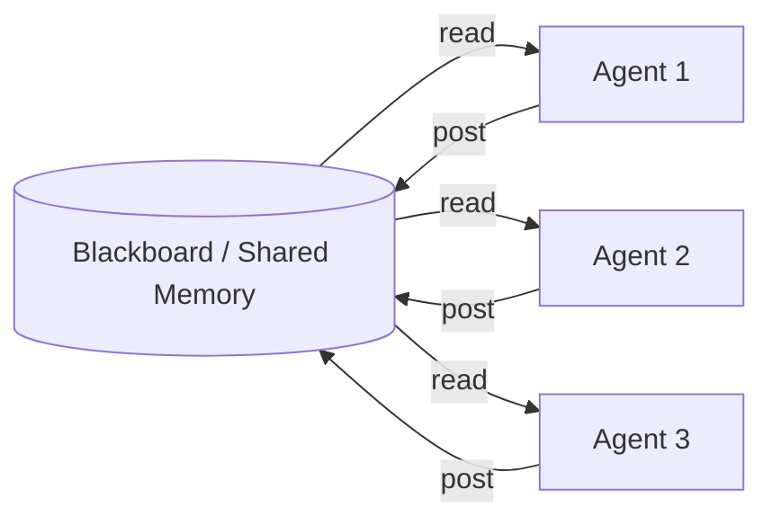
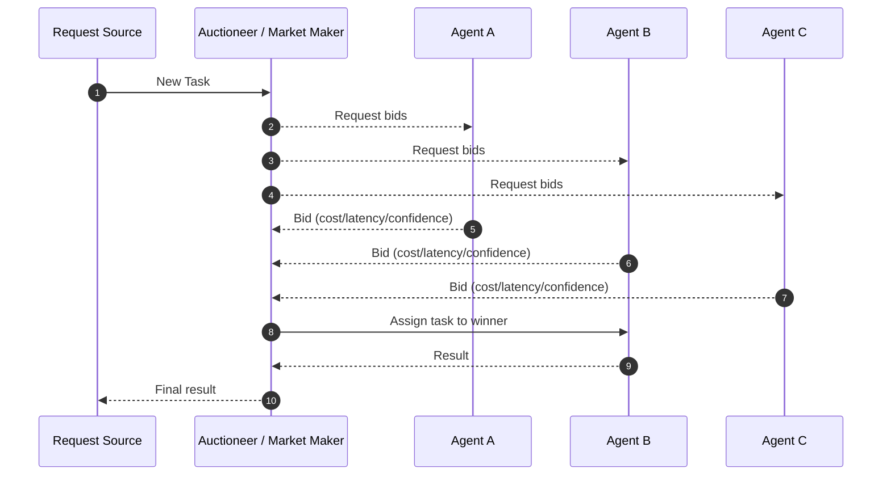

# Diagram: Multi-agent Collaboration Patterns (Event-driven)

## Coordinator / Orchestrator pattern (event-driven)

## Leaderless Swarm (dispatcher + all-to-all)

## Blackboard (shared memory + opportunistic agents)

## Market-based (auction/bidding)

