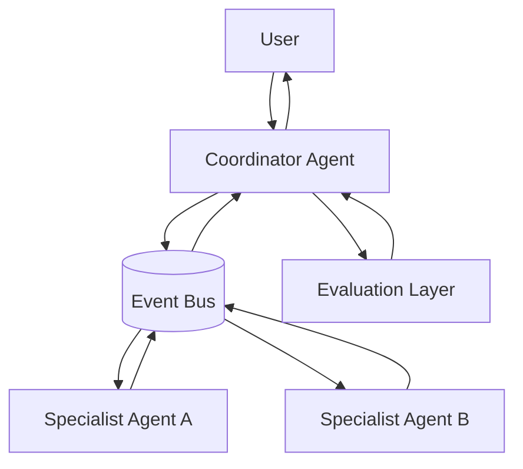
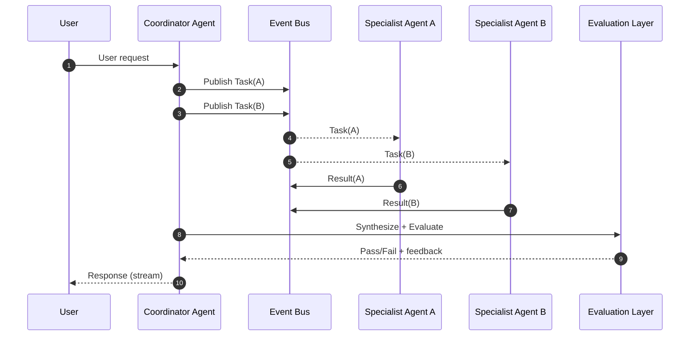
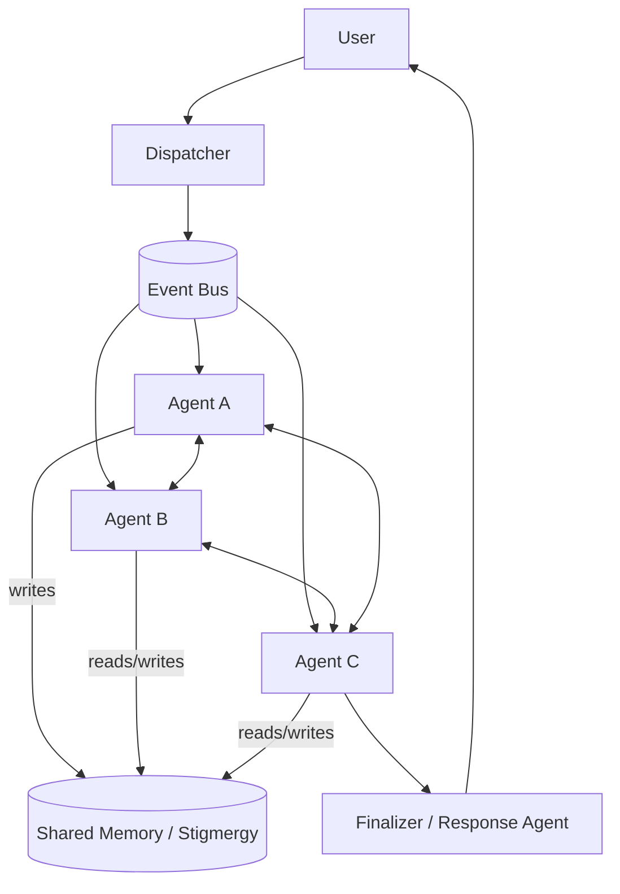
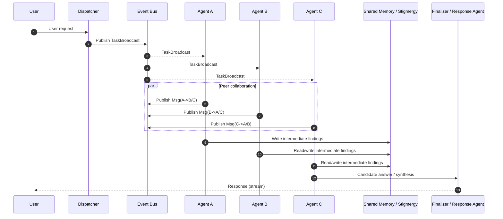
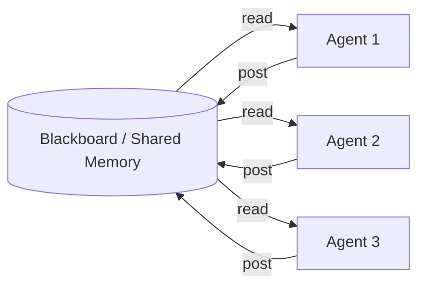
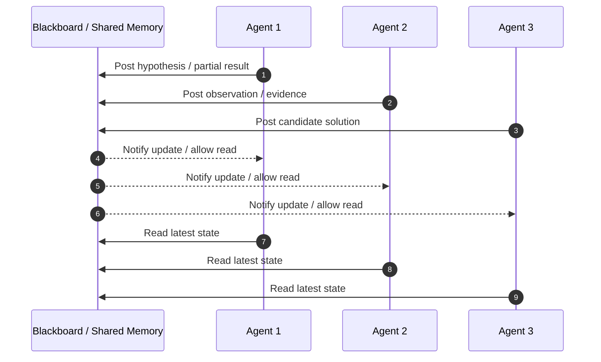
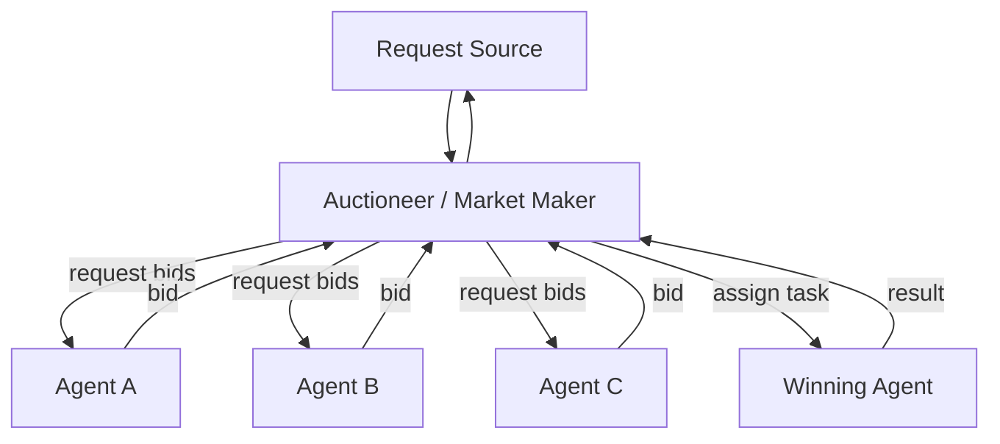
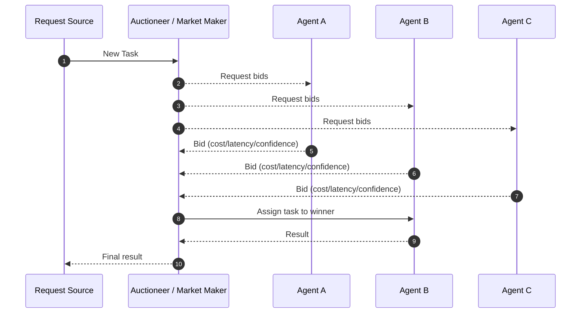

# Diagram: Multi-agent Collaboration Patterns (Event-driven)

Each pattern below is documented with two complementary views:
- **DataFlow** diagram (Mermaid `flowchart`) showing structural data movement.
- **Activity** diagram (Mermaid `sequenceDiagram`) showing message/event ordering.

## Coordinator / Orchestrator pattern (event-driven)

### DataFlow

### Activity

## Leaderless Swarm (dispatcher + all-to-all)

### DataFlow

### Activity

## Blackboard (shared memory + opportunistic agents)

### DataFlow

### Activity

## Market-based (auction/bidding)

### DataFlow

### Activity

