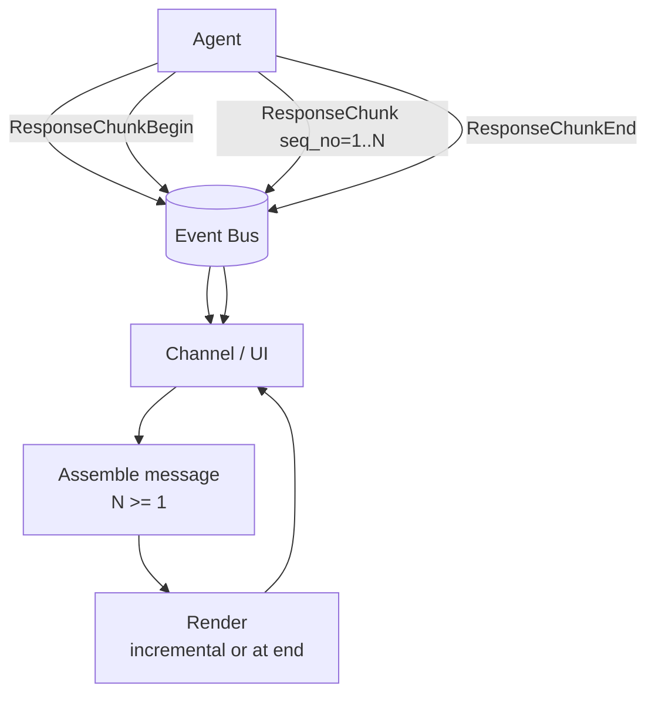
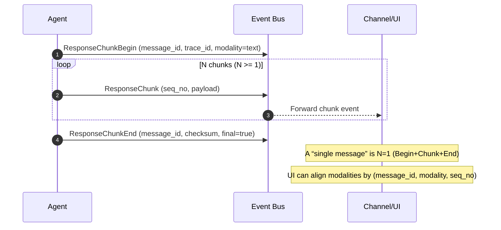

# Diagram: Streaming Chunks and Multimodal-ready Markers

This topic is documented with two complementary views:
- **DataFlow** diagram (Mermaid `flowchart`) showing structural data movement.
- **Activity** diagram (Mermaid `sequenceDiagram`) showing message/event ordering.

## Streaming chunks

Canonical contract: all agent responses are represented as a **chunk-framed stream** where the number of chunks $N \ge 1$.
- A “single message” is encoded as `Begin` → `Chunk(seq_no=1)` → `End`.
- A “streamed message” is the same contract with $N > 1$.

### DataFlow

### Activity

