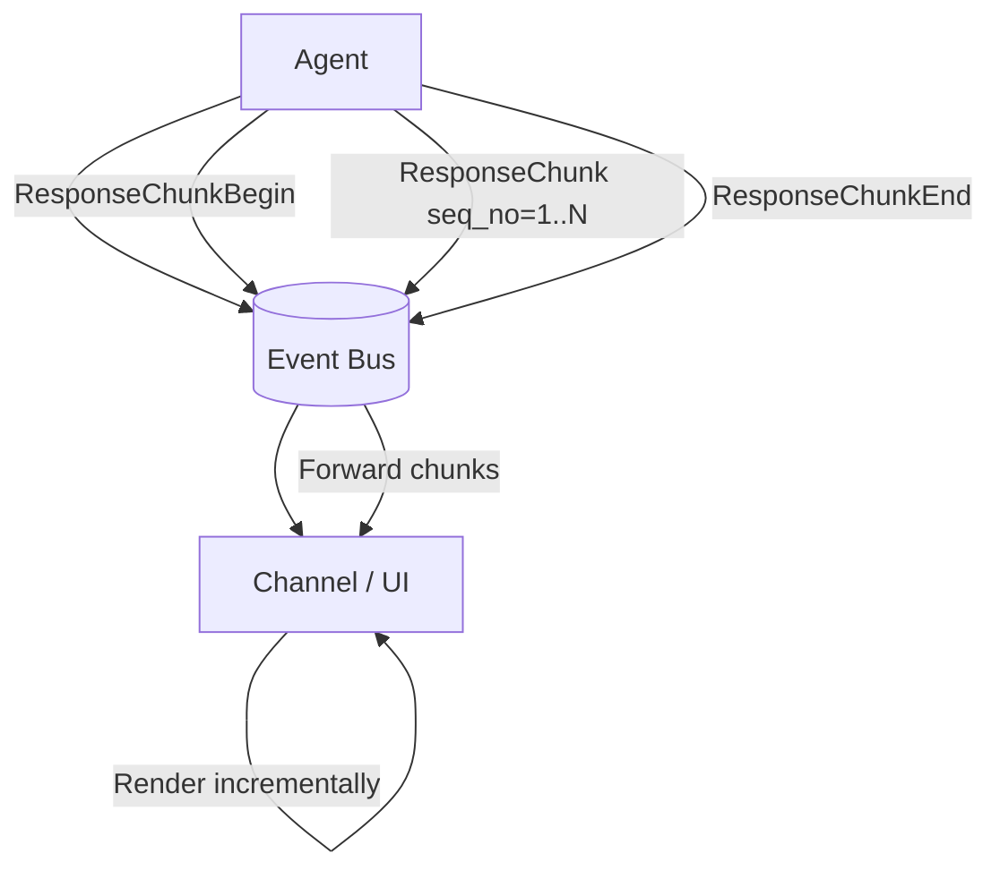
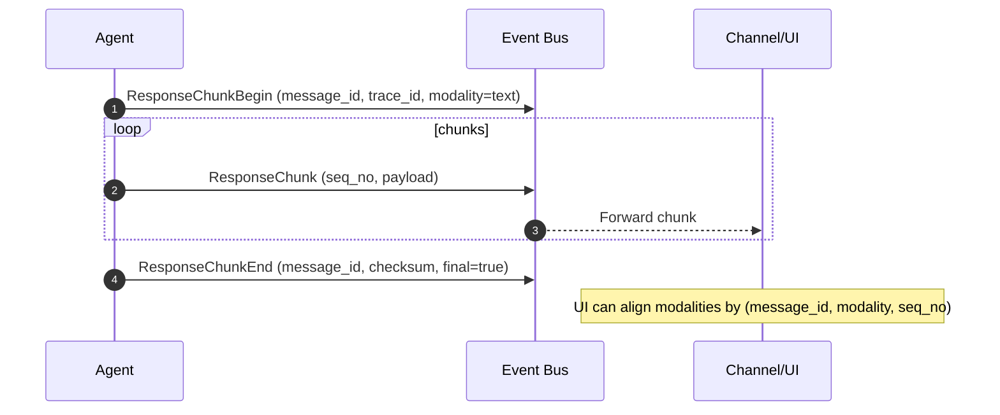

# Diagram: Streaming Chunks and Multimodal-ready Markers

This topic is documented with two complementary views:
- **DataFlow** diagram (Mermaid `flowchart`) showing structural data movement.
- **Activity** diagram (Mermaid `sequenceDiagram`) showing message/event ordering.

## Streaming chunks

### DataFlow

### Activity

