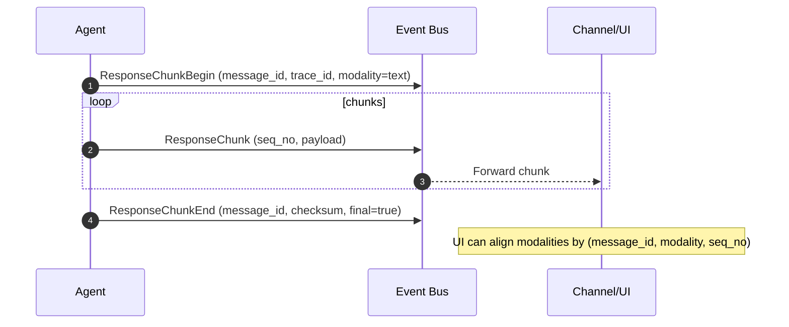

# Diagram: Streaming Chunks and Multimodal-ready Markers

```mermaid
sequenceDiagram
  autonumber
  participant Agent
  participant Bus as Event Bus
  participant UI as Channel/UI

  Agent->>Bus: ResponseChunkBegin (message_id, trace_id, modality=text)
  loop chunks
    Agent->>Bus: ResponseChunk (seq_no, payload)
    Bus-->>UI: Forward chunk
  end
  Agent->>Bus: ResponseChunkEnd (message_id, checksum, final=true)

  Note over UI: UI can align modalities by (message_id, modality, seq_no)
```
