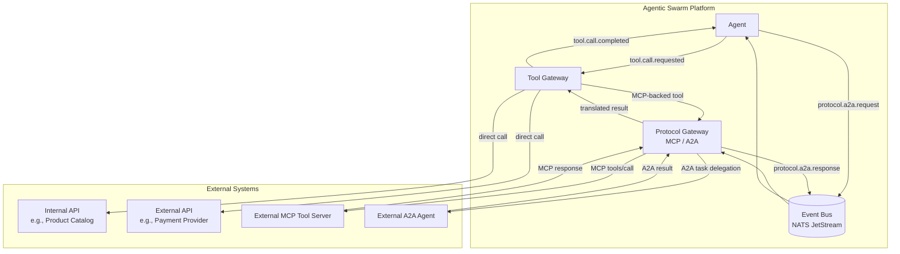
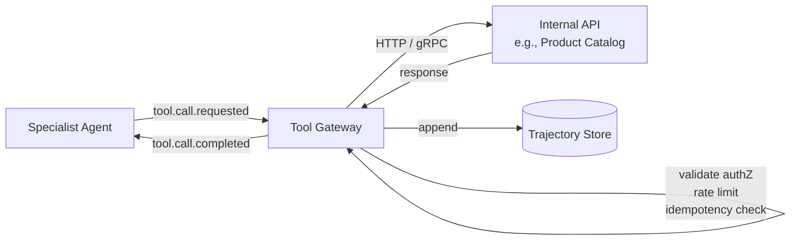
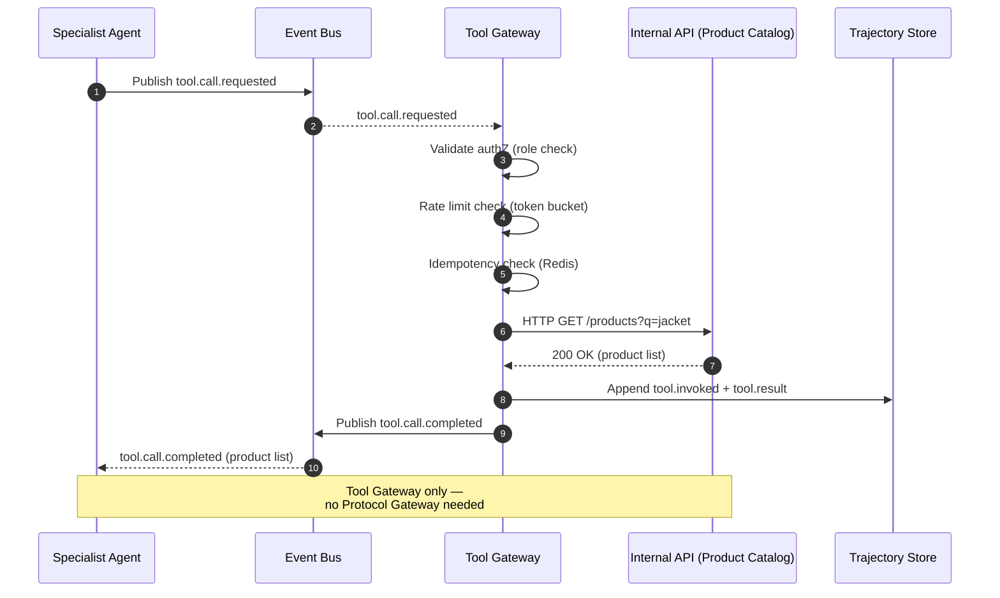
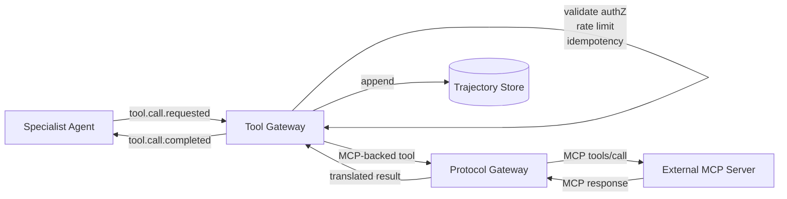
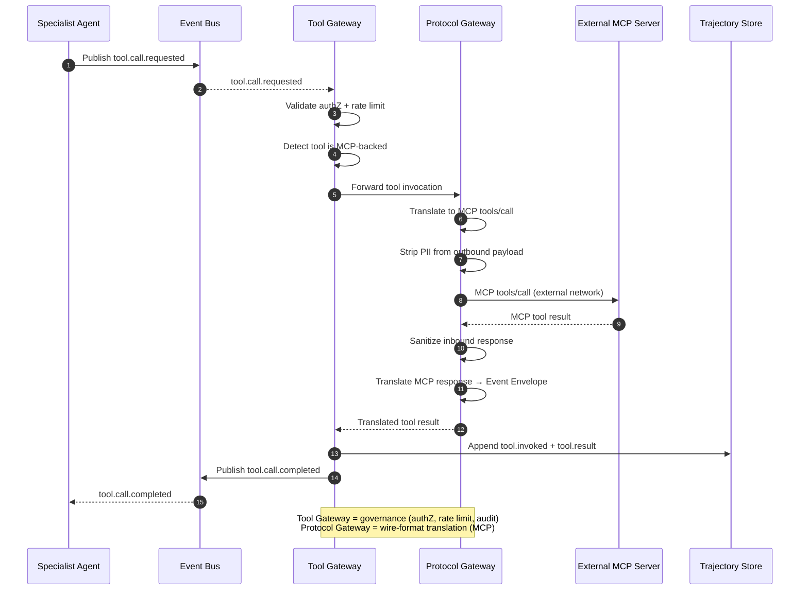
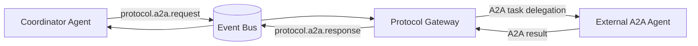
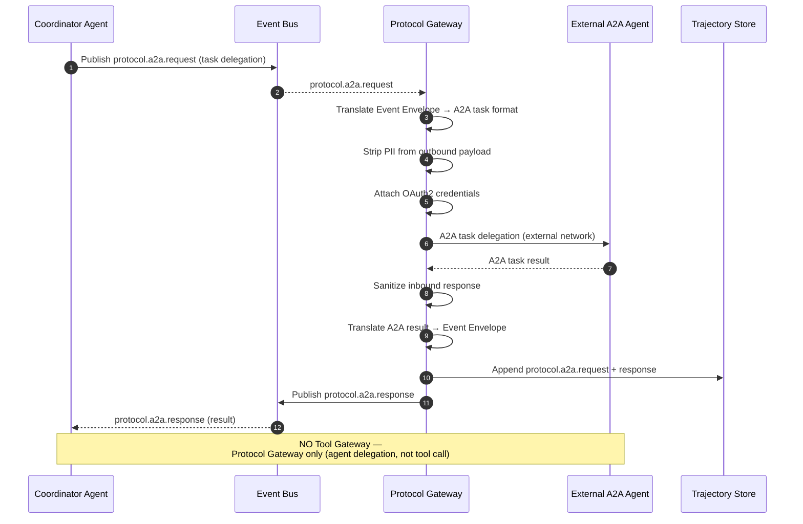

# Diagram: Tool Invocation & Gateway Paths

This document focuses on **tool invocation and external integration paths**, clarifying when the Tool Gateway and Protocol Gateway are involved. For internal agent-to-agent communication patterns, see [02_patterns.md](02_patterns.md).

Each path is documented with two complementary views:
- **DataFlow** diagram (Mermaid `flowchart`) showing structural data movement.
- **Activity** diagram (Mermaid `sequenceDiagram`) showing message/event ordering.

Sources: [high_level_architecture.md](../high_level_architecture.md), [07_tooling_and_integrations.md](../considerations/07_tooling_and_integrations.md), [14_protocol_wrappers_mcp_a2a.md](../considerations/14_protocol_wrappers_mcp_a2a.md)

**Key distinction:**
- **Tool Gateway** — governance layer for all tool calls (authZ, rate limits, idempotency, audit).
- **Protocol Gateway** — wire-format translator for external protocols (MCP, A2A). Internal agents never see these protocols.

---

## 1. Overview

### DataFlow

---

## 2. Agent → Internal Tool (Tool Gateway only)

  B1->>B1: Process event
  B1->>Bus: Publish reply event
  Bus-->>A: reply event

---

## 2. Agent → Internal Tool (Tool Gateway only)

Tool calls to platform-owned APIs pass through the Tool Gateway for governance. No Protocol Gateway involved.

### DataFlow

### Activity

---

## 3. Agent → External Tool via MCP (Tool Gateway + Protocol Gateway)

When a tool is backed by an external MCP server, the request flows through **both** gateways in sequence.

### DataFlow

### Activity

---

## 4. Agent ↔ External Agent via A2A (Event Bus + Protocol Gateway, NO Tool Gateway)

Agent-to-agent delegation to an external agent uses only the Protocol Gateway. The Tool Gateway is **not** involved — this is agent delegation, not a tool call.

### DataFlow

### Activity

---

## Summary: Which gateway is involved?

| Communication Path | Event Bus | Tool Gateway | Protocol Gateway |
|---|:---:|:---:|:---:|
| **Agent → Agent** (internal) | ✅ | — | — |
| **Agent → Internal Tool** | ✅ | ✅ | — |
| **Agent → External API Tool** (non-MCP) | ✅ | ✅ | — |
| **Agent → External MCP Tool** | ✅ | ✅ | ✅ |
| **Agent → External A2A Agent** | ✅ | — | ✅ |
