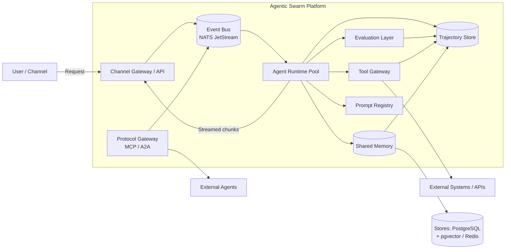

# High-level architecture — Event-Driven Agentic Swarm Framework (E-commerce)

> This file is the executive summary. Deep dives live in `design/considerations/` and decisions in `design/adr/`.

## 1. Motivation and problem statement

### 1.1 Why move beyond the previous LangGraph "static workflow graph" approach?

Our initial e-commerce shopping-assistant system was built on **LangGraph**, a framework that models agent collaboration as a **static directed graph** with conditional edges evaluated at runtime. After shipping to production, we observed the following structural limitations:

| Limitation | Description |
|---|---|
| **Graph rigidity** | Every new agent interaction requires a code change to the graph definition. Product teams cannot compose new swarm behaviors without modifying shared infrastructure. Adding a specialist agent to a workflow meant touching graphs owned by other teams. |
| **Conditional edge sprawl** | As the number of agents and branching conditions grew, the graph became a tangled state machine. Debugging which path was taken required tracing through dozens of conditional callables. |
| **Limited dynamism** | LangGraph graphs are defined at import time. True dynamic task decomposition — where an agent decides at runtime which other agents to recruit — requires awkward workarounds (e.g., "super-nodes" that internally spin up sub-graphs). |
| **Tight coupling** | Agents are callable functions wired directly into the graph. Changing the interface of one agent often cascades through the graph definition and tests. |
| **No native streaming** | LangGraph's streaming is token-level on a single LLM call. We need structured **chunk begin/end framing** across multi-agent conversations for multimodal time-sync (e.g., aligning text + product-card carousel renders). |
| **Poor horizontal scaling** | A single graph executor runs in one process. Scaling means replicating the entire graph; there is no way to independently scale hot agents (e.g., the product-search agent during flash-sale traffic). |
| **Evaluation gaps** | No built-in hooks for per-agent evaluation, reflection loops, or system-level guardrails — evaluation was bolted on externally and was fragile. |
| **Replay difficulty** | Reconstructing the exact trajectory of a past conversation required manual log stitching; there was no first-class Trajectory Store. |

**Why event-driven?** An event-driven architecture addresses every limitation above:
- Agents are **loosely coupled** services communicating via an Event Bus.
- Workflows are **data-driven**: an agent publishes a task event and any agent that subscribes can handle it, enabling dynamic composition.
- Individual agents scale **independently** behind topic partitions.
- Every event is recorded in a **Trajectory Store**, giving us replay and audit for free.
- Streaming becomes a **first-class protocol** (chunk begin/end events on the bus).

### 1.2 Target outcomes

1. Production-grade event-driven multi-agent framework for e-commerce products (shopping assistants, return-handling bots, post-purchase support, review-summarization agents).
2. Easy for product teams to compose agent swarms from shared "platform agents" without modifying framework code.
3. Supports both coordinator-driven and leaderless collaboration modes within the same runtime.
4. Provides built-in evaluation, reflection, guardrails, and full trajectory capture.
5. Integrates with external agents and tools via protocol wrappers (MCP, A2A).

## 2. Architecture overview

### 2.1 Key components

| Component | Responsibility | Deep dive |
|---|---|---|
| **Agent Runtime** | Lifecycle management (start, heartbeat, shutdown), concurrency control, retry policies, timeout enforcement, health checks. Python-first implementation using `asyncio`. | [considerations/03](considerations/03_agent_runtime_and_lifecycle.md), [ADR-0003](adr/ADR-0003-agent-runtime-model.md) |
| **Event Bus** | Pub/sub backbone for all inter-agent messaging. Supports topic-based routing, consumer groups, ordered delivery per partition, and dead-letter queues. | [considerations/01](considerations/01_communication_patterns.md), [ADR-0001](adr/ADR-0001-messaging-backbone.md) |
| **Message Contracts** | Canonical envelope schema (JSON), schema registry, versioning (backward-compatible evolution), validation at publish time. | [considerations/04](considerations/04_message_schema_and_contracts.md) |
| **Shared Memory** | Session memory (Redis), long-term memory (PostgreSQL + pgvector), blackboard/stigmergy store for leaderless collaboration. | [considerations/06](considerations/06_memory_architecture_shared_state.md), [ADR-0004](adr/ADR-0004-memory-state-strategy.md) |
| **Tool Gateway** | Unified interface for tool invocations (internal APIs, DB queries, external services). Enforces authZ, rate limits, audit logging, and idempotency keys. | [considerations/07](considerations/07_tooling_and_integrations.md) |
| **Evaluation Layer** | Per-agent output evaluation, system-level response evaluation, planning-reflection loops with configurable depth limits, safety guardrails (content filtering, PII detection). | [considerations/08](considerations/08_evaluation_reflection_and_guardrails.md), [ADR-0006](adr/ADR-0006-evaluation-guardrails.md) |
| **Trajectory Store** | Append-only event log capturing every message, tool call, evaluation result, and state mutation. Supports replay, audit, regression testing, and cost attribution. | [considerations/09](considerations/09_observability_tracing_replay.md), [ADR-0007](adr/ADR-0007-observability-replay.md) |
| **Streaming Pipeline** | Chunk-framed streaming protocol with explicit begin/end markers, sequence numbers, and modality tags for multimodal synchronization. | [considerations/05](considerations/05_streaming_chunking_and_multimodal_sync.md), [ADR-0005](adr/ADR-0005-streaming-chunk-protocol.md) |
| **Protocol Gateway** | Adapters for MCP (Model Context Protocol) and A2A (Agent-to-Agent) to interoperate with external agent ecosystems. | [considerations/14](considerations/14_protocol_wrappers_mcp_a2a.md), [ADR-0008](adr/ADR-0008-protocol-gateway-mcp-a2a.md) |
| **Observability Stack** | Distributed tracing (OpenTelemetry), structured logging, metrics (Prometheus), cost/token tracking dashboards. | [considerations/09](considerations/09_observability_tracing_replay.md) |
| **Prompt Registry** | Versioned prompt templates, A/B testing support, automated prompt regression runs in CI. | [considerations/13](considerations/13_prompt_management_and_versioning.md) |

### 2.2 Architecture diagram

See: [design/diagrams/01_overview.md](diagrams/01_overview.md)

## 3. Communication patterns: coordinator vs leaderless swarm vs hybrid

This section summarizes the trade-offs. The full analysis is in [considerations/01_communication_patterns.md](considerations/01_communication_patterns.md).

### 3.1 Coordinator / orchestrator-managed collaboration

**When it fits:**
- Structured workflows with well-defined steps (e.g., "search → filter → recommend → checkout").
- Compliance-sensitive flows where a single agent must enforce ordering and authorization.
- Workflows that need deterministic cost budgets (coordinator can enforce global token limits).

**How it works (event-driven):**
1. Coordinator receives user request via the Event Bus.
2. Coordinator publishes task events to specialist topic(s).
3. Specialist agents consume tasks, produce results, publish back to the bus.
4. Coordinator aggregates, evaluates, and responds.

**Risks:**
- Coordinator becomes a bottleneck and single point of failure.
- Every interaction doubles LLM calls (specialist + coordinator reasoning).
- Coordinator prompt grows complex as the number of specialists increases.

**Mitigations:**
- Stateless coordinator with Event Bus-backed state recovery.
- Circuit breakers and fallback paths.
- Coordinator prompt is generated from a specialist registry (not hand-maintained).

See: [diagrams/02_patterns.md — Coordinator pattern](diagrams/02_patterns.md)

### 3.2 Leaderless / swarm collaboration

**When it fits:**
- Ambiguous problems requiring debate (e.g., "Is this product review authentic?" — multiple agents contribute evidence).
- Creative synthesis where no single agent has the full answer.
- Resilience-critical paths where losing one agent should not block progress.

**How it works (event-driven):**
1. Dispatcher publishes a broadcast task event.
2. All participating agents receive the event and begin working.
3. Agents coordinate via Shared Memory (stigmergy / blackboard pattern) and direct peer messages on the Event Bus.
4. A finalizer agent (or quorum rule) assembles the response.

**Risks:**
- Non-convergence: agents may loop without reaching consensus.
- Unbounded chatter: without a coordinator, message volume can explode.
- Cost unpredictability: no single entity enforces a token budget.

**Mitigations:**
- **Turn limits** and **message-count budgets** enforced by the Agent Runtime.
- **Convergence detectors**: a lightweight monitor agent that detects repeated states in Shared Memory and triggers early termination.
- **Cost ceiling**: per-session token budget enforced at the Event Bus level (reject publishes after budget exhaustion).

See: [diagrams/02_patterns.md — Leaderless Swarm pattern](diagrams/02_patterns.md)

### 3.3 Hybrid model (recommended)

**Recommendation:** Use a **coordinator-first, swarm-when-needed** hybrid.

- Default to coordinator-managed flows for predictable workflows (product search, order tracking, returns).
- Allow coordinators to **delegate sub-problems** to leaderless swarms when the problem requires multi-perspective synthesis (e.g., complex product comparisons, dispute resolution).
- The coordinator sets a **budget envelope** (max tokens, max turns, timeout) for any swarm delegation.

This hybrid is documented in [ADR-0002](adr/ADR-0002-hybrid-communication-pattern.md).

### 3.4 Additional patterns supported

The framework also supports two additional collaborative patterns as building blocks:

| Pattern | Use case | Diagram |
|---|---|---|
| **Blackboard / Shared Memory** | Opportunistic agents post observations to a shared space; other agents react. Used for progressive knowledge assembly. | [diagrams/02_patterns.md — Blackboard](diagrams/02_patterns.md) |
| **Market-based (Auction/Bidding)** | An auctioneer broadcasts a task; agents bid based on confidence, cost, or capability. Winner executes. Good for dynamic routing when agent capabilities overlap. | [diagrams/02_patterns.md — Market-based](diagrams/02_patterns.md) |

## 4. Streaming + multimodal-ready response pipeline

All agent responses use a **chunk-framed streaming protocol** (see [ADR-0005](adr/ADR-0005-streaming-chunk-protocol.md)):

| Event | Purpose |
|---|---|
| `ResponseChunkBegin` | Opens a stream. Contains `message_id`, `trace_id`, `modality` (text, image, carousel, etc.), and `expected_chunks` (optional hint). |
| `ResponseChunk` | Carries payload. Contains `seq_no` (1-based), `payload`, and `is_partial` flag. |
| `ResponseChunkEnd` | Closes the stream. Contains `message_id`, `checksum`, `final` flag, and `total_chunks`. |

**Design invariant:** A "single message" is always `Begin(N=1) → Chunk(seq_no=1) → End`. This means consumers never need to distinguish between streamed and non-streamed responses; the protocol is the same.

**Multimodal synchronization:** Multiple modalities within the same turn are correlated by `message_id` and differentiated by `modality` tag. The UI layer can align rendering (e.g., text arrives before product cards; the UI holds a slot for the carousel until its `ResponseChunkEnd` arrives).

See: [considerations/05](considerations/05_streaming_chunking_and_multimodal_sync.md), [diagrams/03_streaming_chunks.md](diagrams/03_streaming_chunks.md)

## 5. Evaluation, reflection, and guardrails

Built-in evaluation hooks run at three boundaries:

| Boundary | What is evaluated | Example |
|---|---|---|
| **Tool-call boundary** | Input validation, authorization, output sanity checks. | "Is this SQL query safe to execute?" |
| **Agent output boundary** | Per-agent response quality, relevance, factuality, tone. | "Does this product description contain hallucinated specs?" |
| **System response boundary** | End-to-end response quality, safety, compliance. | "Does the final shopping recommendation violate any content policies?" |

**Planning-reflection loops:** Agents can be configured with a `reflect` phase that re-evaluates their draft output before publishing it. Reflection is parameterized:
- `max_reflection_rounds`: hard cap (default: 2).
- `reflection_criteria`: list of evaluation dimensions (relevance, safety, completeness).
- `reflection_model`: can use a cheaper/faster model for self-critique.

See: [considerations/08](considerations/08_evaluation_reflection_and_guardrails.md), [ADR-0006](adr/ADR-0006-evaluation-guardrails.md)

## 6. Replayability and observability

**Trajectory capture:** Every event on the Event Bus is durably stored in the Trajectory Store with:
- `trace_id` (spans a full user session across all agents),
- `span_id` (individual agent invocation),
- `parent_span_id` (delegation chain),
- `timestamp` (wall-clock, monotonic),
- `event_type`, `payload`, `agent_id`, `session_id`.

**Replay modes:**
1. **Deterministic replay** — For tool calls with recorded responses, replay feeds cached responses. Useful for regression testing.
2. **Best-effort replay** — For LLM calls, replay re-invokes the model (results will differ). Useful for debugging and evaluation.
3. **Cost-free replay** — Replay the event log in a read-only viewer without executing anything. Useful for audit.

**Automated prompt runs (CI/CD):**
Prompt regression suites record golden trajectories. On prompt changes, CI replays golden inputs and compares outputs using evaluation metrics. Regressions block deployment.

See: [considerations/09](considerations/09_observability_tracing_replay.md), [ADR-0007](adr/ADR-0007-observability-replay.md)

## 7. Protocol gateways (MCP / A2A)

The framework exposes and consumes external agents via a **Protocol Gateway** layer:

| Protocol | Direction | Purpose |
|---|---|---|
| **MCP (Model Context Protocol)** | Inbound + Outbound | Expose our tools as MCP servers; consume external MCP tool servers. |
| **A2A (Agent-to-Agent)** | Inbound + Outbound | Expose our agents as A2A-compatible endpoints; delegate tasks to external A2A agents. |

The Protocol Gateway translates between the external protocol's message format and our internal Event Bus envelope. This keeps internal agents protocol-agnostic.

See: [considerations/14](considerations/14_protocol_wrappers_mcp_a2a.md), [ADR-0008](adr/ADR-0008-protocol-gateway-mcp-a2a.md)

## 8. Security, compliance, and governance

- **AuthZ per tool call**: Every Tool Gateway invocation is gated by role-based permissions.
- **PII handling**: PII detection at ingress; redaction before storage in long-term memory and logs.
- **Audit trail**: Trajectory Store provides a complete, immutable audit log.
- **Rate limiting**: Per-agent and per-session token budgets enforced at the Event Bus and LLM gateway levels.
- **Content safety**: Guardrail evaluators run as mandatory post-processing before any user-facing response.

See: [considerations/11](considerations/11_security_privacy_compliance.md)

## 9. Conclusions and recommendations

### 9.1 Final recommendations

| Decision area | Recommendation | ADR |
|---|---|---|
| **Messaging backbone** | NATS JetStream — lightweight, high-throughput, persistent streams, built-in consumer groups | [ADR-0001](adr/ADR-0001-messaging-backbone.md) |
| **Communication pattern** | Hybrid: coordinator-first with swarm delegation for complex sub-problems | [ADR-0002](adr/ADR-0002-hybrid-communication-pattern.md) |
| **Agent Runtime** | Python asyncio-based runtime with structured concurrency, health probes, and graceful shutdown | [ADR-0003](adr/ADR-0003-agent-runtime-model.md) |
| **Memory / state** | Tiered: Redis (session) + PostgreSQL/pgvector (long-term) + blackboard abstraction over Redis pub/sub | [ADR-0004](adr/ADR-0004-memory-state-strategy.md) |
| **Streaming protocol** | Chunk-framed, begin/end markers, seq_no, modality tags | [ADR-0005](adr/ADR-0005-streaming-chunk-protocol.md) |
| **Evaluation / guardrails** | Built-in evaluation hooks at three boundaries with configurable reflection loops | [ADR-0006](adr/ADR-0006-evaluation-guardrails.md) |
| **Observability + replay** | OpenTelemetry tracing + append-only Trajectory Store in PostgreSQL with replay engine | [ADR-0007](adr/ADR-0007-observability-replay.md) |
| **Protocol Gateway** | Thin adapter layer for MCP/A2A; internal agents remain protocol-agnostic | [ADR-0008](adr/ADR-0008-protocol-gateway-mcp-a2a.md) |
| **Deployment + scaling** | Kubernetes with per-agent-type deployments; HPA on queue depth; namespace isolation per tenant | [ADR-0009](adr/ADR-0009-deployment-scaling-isolation.md) |

### 9.2 Incremental roadmap

| Phase | Scope | Duration (est.) |
|---|---|---|
| **Phase 1 — PoC** | Single coordinator + 2 specialist agents on NATS JetStream. Basic streaming. Manual evaluation. In-memory session state. | 4–6 weeks |
| **Phase 2 — Pilot** | Add leaderless swarm mode. Trajectory Store in PostgreSQL. OpenTelemetry integration. Prompt Registry. First product team onboarded. | 6–8 weeks |
| **Phase 3 — Production hardening** | Evaluation Layer with guardrails. Protocol Gateway (MCP). Multi-tenant isolation. CI prompt regression pipeline. Load testing. | 8–12 weeks |
| **Phase 4 — Scale-out** | A2A gateway. Market-based routing. Advanced reflection loops. Cost attribution dashboards. Chaos testing. | Ongoing |

### 9.3 Open questions

1. **LLM provider strategy**: Should the framework abstract over multiple LLM providers (OpenAI, Anthropic, local models) from day one, or start with a single provider and abstract later? — Recommendation: start with a single provider (OpenAI) behind a thin abstraction layer; swap cost is low if the abstraction is clean.
2. **Multi-tenancy model**: Namespace-per-tenant vs. shared namespace with tenant-ID filtering? — See [ADR-0009](adr/ADR-0009-deployment-scaling-isolation.md).
3. **Vector store choice**: pgvector vs. dedicated vector DB (Qdrant, Weaviate)? — For Phase 1–2, pgvector is sufficient. Re-evaluate at Phase 3 based on retrieval latency data.
