# Communication Patterns & Integration Paths

This document covers all communication in the framework: how agents collaborate with each other, how they invoke tools, how they reach external systems, and how responses stream back to users.

The **hybrid model** (Coordinator-first with swarm delegation) is the recommended default.

---

## Part 1 — Agent-to-Agent Collaboration Patterns

### 1.1 Coordinator / Orchestrator

A central **Coordinator Agent** plans execution, delegates sub-tasks to **Specialist Agents** via the **Event Bus**, and synthesizes results.

**When to use:** Structured workflows with well-defined steps (search → filter → recommend → checkout), compliance-sensitive flows, deterministic cost budgets.

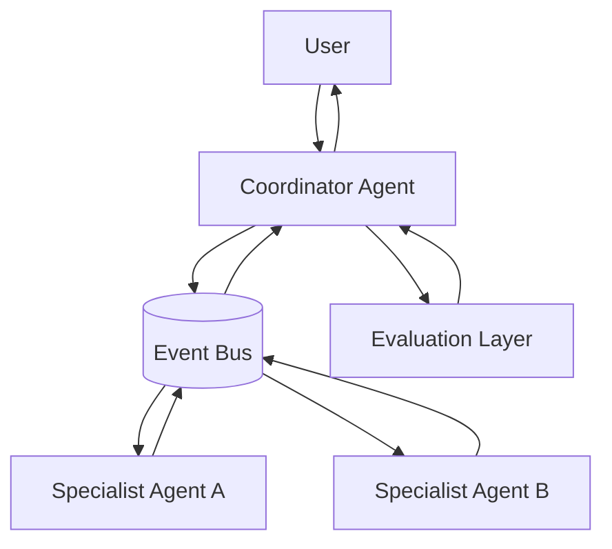

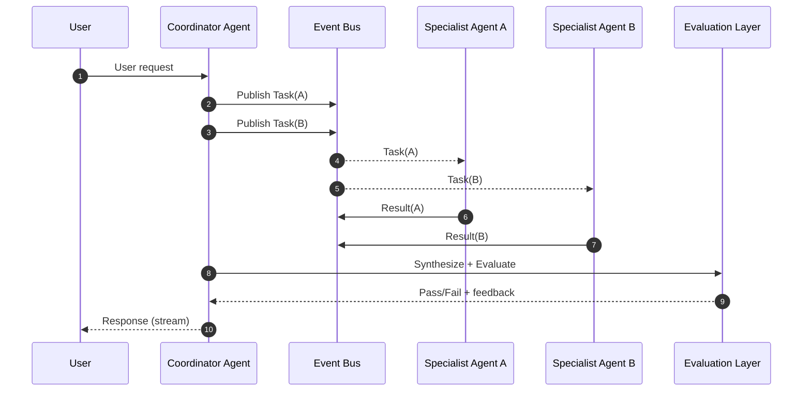

**Risks:** Coordinator bottleneck; every interaction doubles LLM calls.
**Mitigations:** Stateless Coordinator with Event Bus-backed state recovery. Coordinator prompt auto-generated from **Capability Registry**.

---

### 1.2 Leaderless Swarm (Broadcast + Peer Collaboration)

A Dispatcher broadcasts a task to all participating agents. Agents collaborate via peer messages on the Event Bus and the **Blackboard** (Shared Memory). A Finalizer assembles the response.

**When to use:** Ambiguous problems requiring multi-perspective debate, creative synthesis, resilience-critical paths.

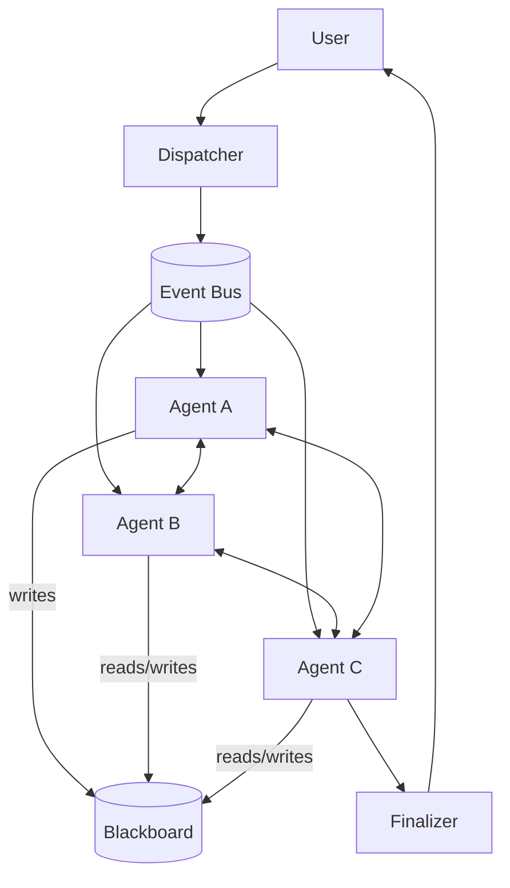

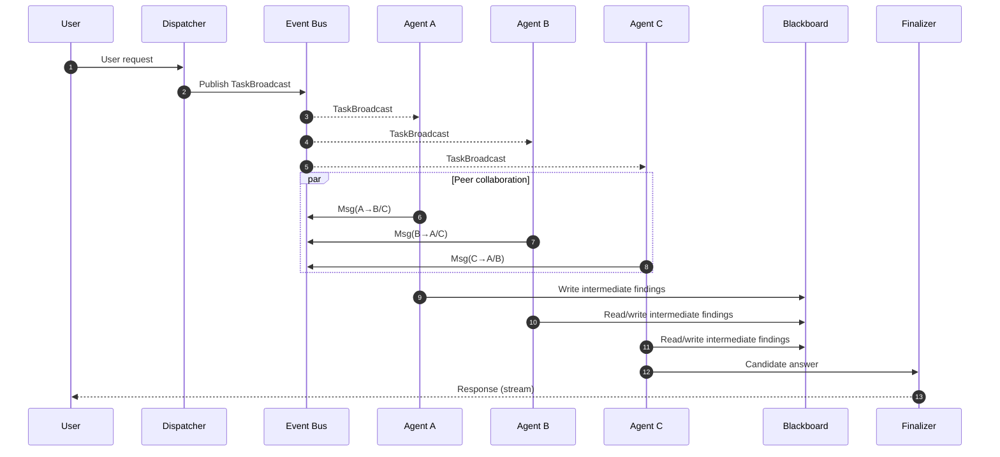

**Risks:** Non-convergence; unbounded chatter; cost unpredictability.
**Mitigations:** Turn limits and message-count budgets (**Agent Runtime**). Convergence detectors. Per-session token **Budget Envelopes** enforced at Event Bus level.

---

### 1.3 Blackboard / Shared Memory

Opportunistic agents post observations to a shared store; other agents react to updates. Used for progressive knowledge assembly without direct orchestration (**Stigmergy**).

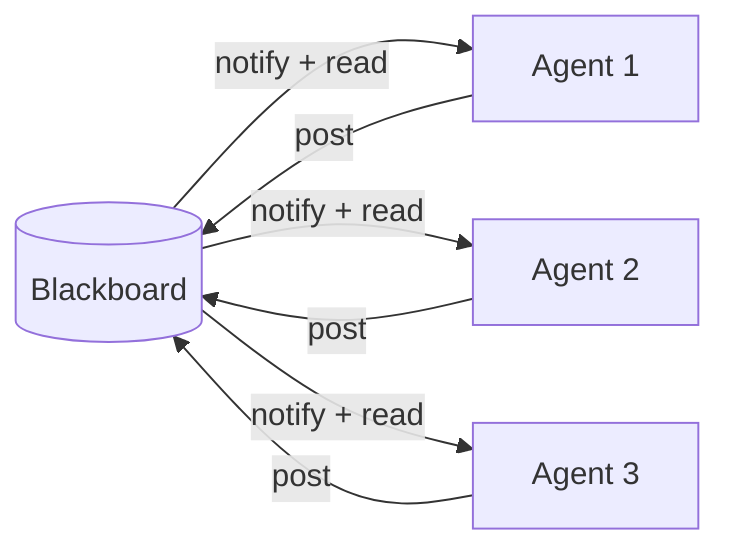

---

### 1.4 Market-Based (Auction / Bidding)

An auctioneer broadcasts a task; agents bid based on confidence, cost, or capability. The winning agent executes.

**When to use:** Dynamic routing when agent capabilities overlap; optimize for cost, latency, or confidence.

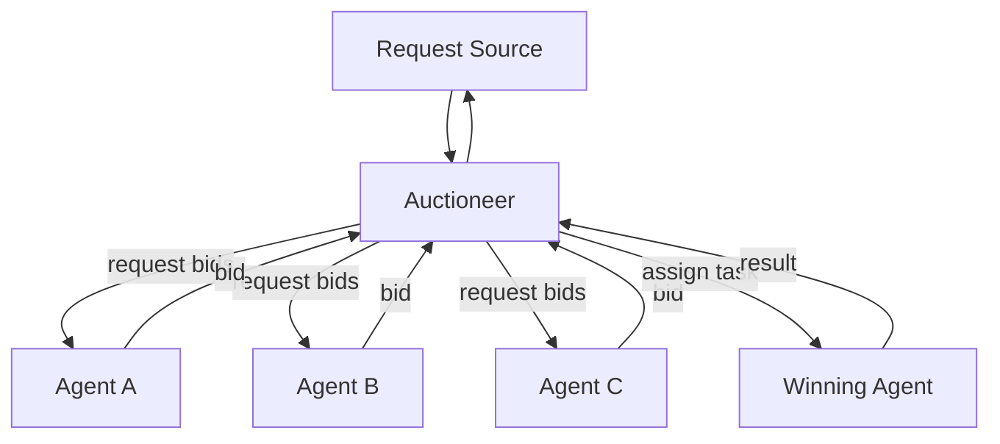

---

### 1.5 Hybrid Model (Recommended)

**Coordinator-first, swarm-when-needed.**

- Default to Coordinator-managed flows for predictable workflows.
- Coordinators may **delegate sub-problems** to leaderless swarms when multi-perspective synthesis is needed.
- The Coordinator sets a **Budget Envelope** (max tokens, max turns, timeout) for any swarm delegation.

**Routing mechanism:** The Coordinator does not hard-code specialist references. Instead:

1. **Capability Registry lookup** — maps capability names → NATS subjects.
2. **LLM-driven planning** — the LLM receives user intent + capability list, decomposes into sub-tasks tagged with `target_capability`.

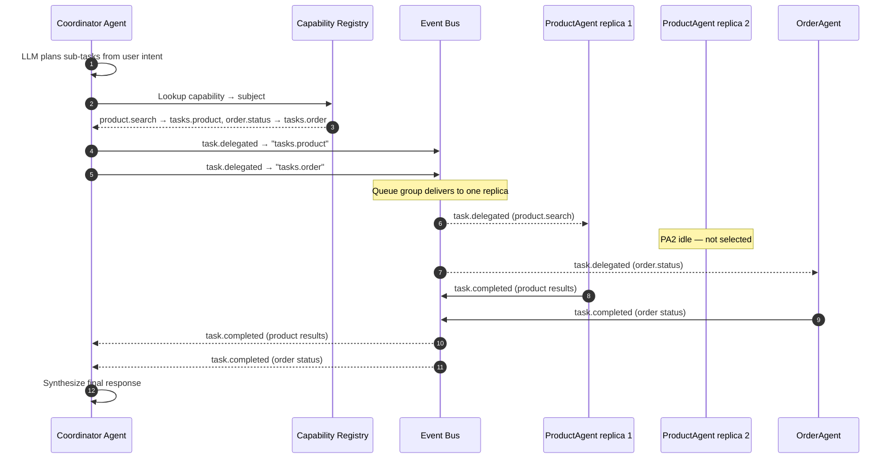

Specialist agents subscribe via NATS JetStream **queue groups** — exactly one replica picks up each message, providing automatic load balancing. In swarm mode, tasks are published to a **broadcast subject** without a queue group so every agent receives every message.

---

## Part 2 — Tool Invocation & External Integration Paths

**Key distinction:**
- **Tool Gateway** — governance layer for all tool calls (authZ, rate limits, idempotency, audit).
- **Protocol Gateway** — wire-format translator for external protocols (MCP, A2A). Internal agents never see these protocols.

### 2.1 Agent → Internal Tool (Tool Gateway only)

Tool calls to platform-owned APIs pass through the **Tool Gateway** for governance. No Protocol Gateway involved.

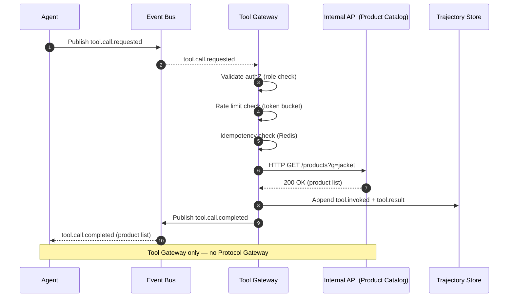

---

### 2.2 Agent → External MCP Tool (Tool Gateway + Protocol Gateway)

When a tool is backed by an external MCP server, the request flows through **both** gateways in sequence:
- **Tool Gateway** handles governance (authZ, rate limits, audit)
- **Protocol Gateway** handles wire-format translation (MCP)

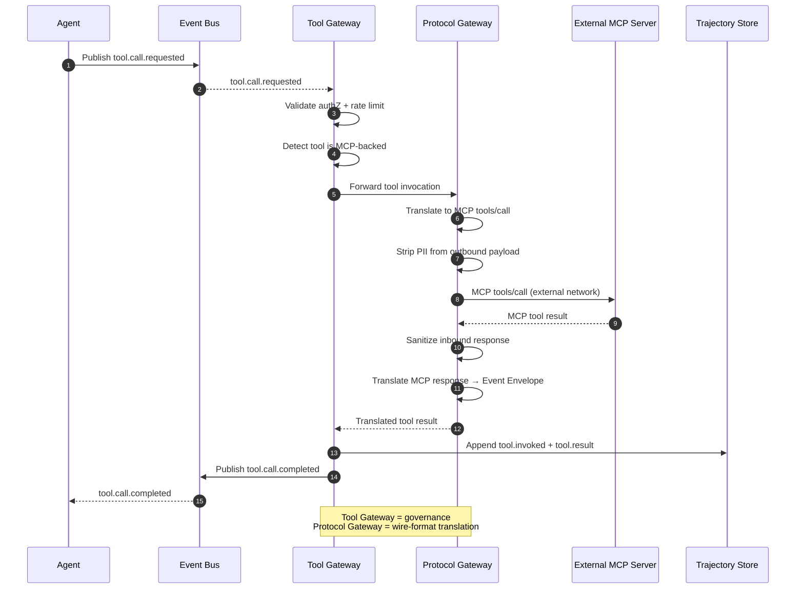

---

### 2.3 Agent ↔ External A2A Agent (Protocol Gateway only, NO Tool Gateway)

Agent-to-agent delegation to an external agent uses only the **Protocol Gateway**. This is agent delegation, not a tool call — the Tool Gateway is **not** involved.

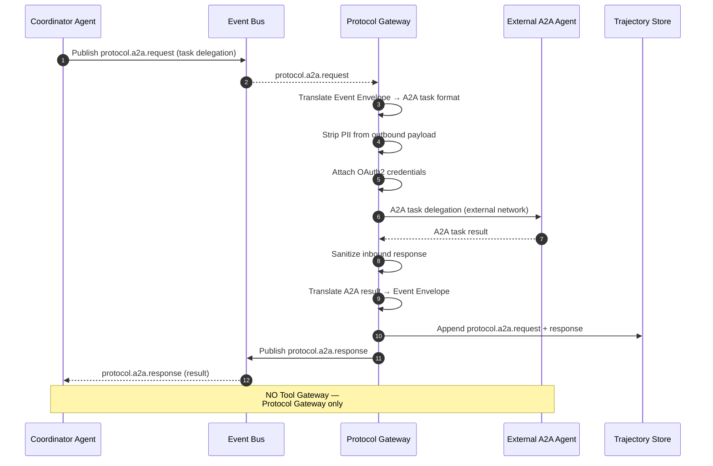

---

## Part 3 — Streaming Protocol

All communication paths deliver responses using the **Chunk-framed Protocol**:

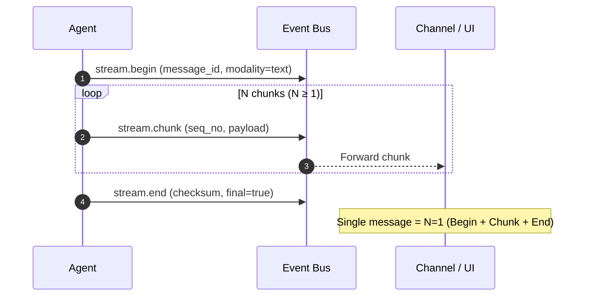

Multimodal responses use the same `message_id` with different `modality` tags (text, image, carousel). The UI aligns rendering by `(message_id, modality, seq_no)`.

---

## Gateway Involvement Summary

| Communication Path | Event Bus | Tool Gateway | Protocol Gateway |
|---|:---:|:---:|:---:|
| **Agent → Agent** (internal) | ✅ | — | — |
| **Agent → Internal Tool** | ✅ | ✅ | — |
| **Agent → External API Tool** (non-MCP) | ✅ | ✅ | — |
| **Agent → External MCP Tool** | ✅ | ✅ | ✅ |
| **Agent → External A2A Agent** | ✅ | — | ✅ |
