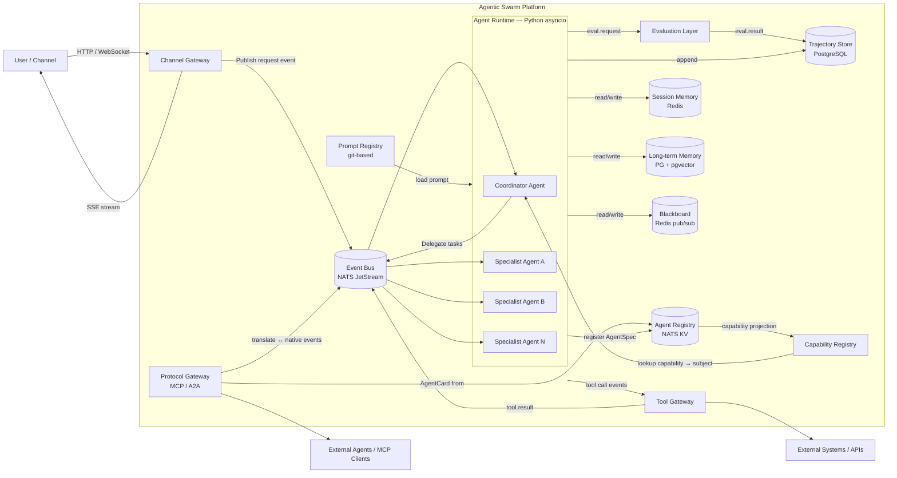
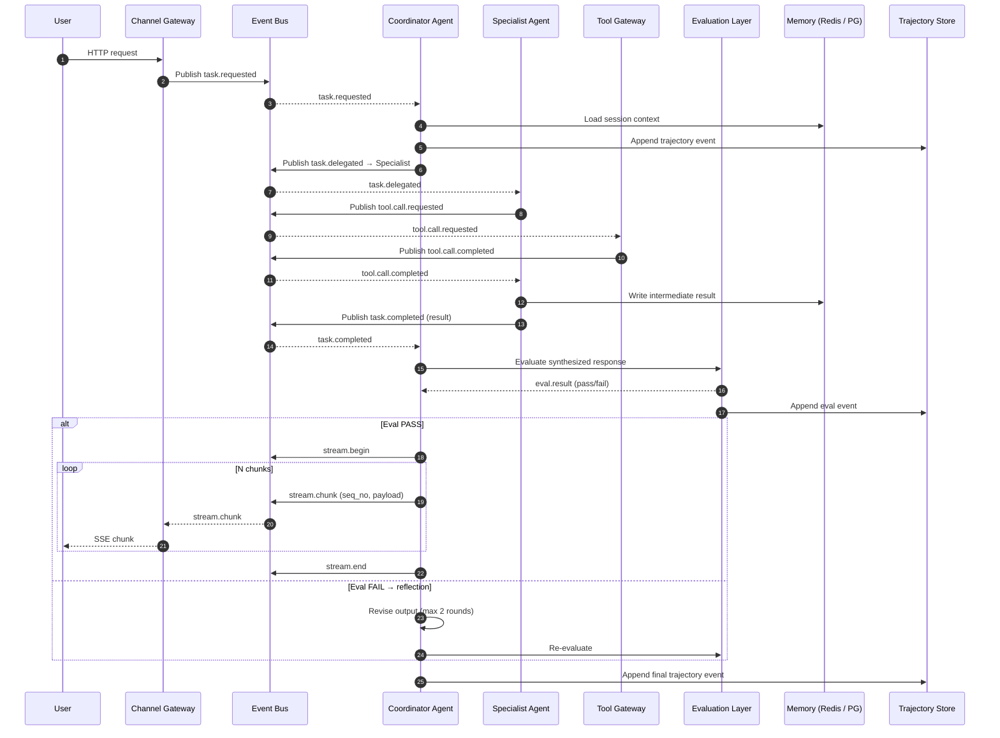

# High-Level Architecture — Event-Driven Agentic Swarm Framework

## 1. Problem Statement

Traditional static-graph agent frameworks (e.g., LangGraph) impose rigid topologies, tight coupling, conditional-edge sprawl, and limited runtime dynamism. Scaling, streaming, evaluation, and replay all require workarounds. An **event-driven architecture** addresses every limitation:

- Agents are **loosely coupled** services communicating via an Event Bus.
- Workflows are **data-driven** — agents publish/subscribe to task events, enabling dynamic composition.
- Individual agents scale **independently** behind topic partitions.
- Every event is recorded in a **Trajectory Store**, giving replay and audit for free.
- Streaming becomes a **first-class protocol** (chunk begin/end events on the bus).

**Target domain:** Enterprise e-commerce — shopping assistants, return-handling bots, post-purchase support, review-summarization agents.

## 2. Target Outcomes

1. Production-grade event-driven multi-agent framework for e-commerce.
2. Product teams compose Agent swarms from shared "platform agents" without modifying framework code.
3. Supports both Coordinator-driven and leaderless collaboration within the same runtime.
4. Built-in Evaluation Layer, Reflection Loops, guardrails, and full Trajectory capture.
5. Integrates with external agents and tools via Protocol Gateway (MCP, A2A).

## 3. Key Components

| Component | Responsibility |
|---|---|
| **Agent Runtime** | Lifecycle management (start, heartbeat, shutdown), concurrency control, retry policies, timeout enforcement, health checks. Python asyncio. Registers AgentSpec with Agent Registry on startup. |
| **Agent Registry & AgentSpec** | Dynamic registry of all agents. Each described by a declarative AgentSpec (capabilities, routing, runtime config, tools, ownership). Capability Registry is a read-only projection mapping capabilities to NATS subjects. Backed by NATS JetStream KV. |
| **Event Bus** | Pub/sub backbone (NATS JetStream) for all inter-agent messaging. Topic-based routing, consumer groups, ordered delivery, dead-letter queues. |
| **Message Contracts** | Canonical Event Envelope schema (JSON/Pydantic), schema registry, versioning (backward-compatible evolution), validation at publish time. |
| **Shared Memory** | Tiered: Session Memory (Redis), Long-term Memory (PostgreSQL + pgvector), Blackboard (Redis pub/sub) for leaderless collaboration. |
| **Tool Gateway** | Unified interface for tool invocations. Enforces authZ, rate limits, audit logging, idempotency keys, and circuit breaking. |
| **Evaluation Layer** | Per-agent and system-level quality gates at tool-call, agent-output, and system-response boundaries. Supports Reflection Loops (max 2 rounds). |
| **Trajectory Store** | Append-only event log (PostgreSQL) capturing every message, tool call, evaluation result, and state mutation. Supports replay, audit, and cost attribution. |
| **Streaming Pipeline** | Chunk-framed protocol with explicit begin/end markers, sequence numbers, and modality tags for multimodal sync. |
| **Protocol Gateway** | Adapters for MCP and A2A to interoperate with external agent ecosystems. Internal agents remain protocol-agnostic. |
| **Observability Stack** | OpenTelemetry tracing, structured logging (`structlog`), Prometheus metrics, Grafana dashboards, cost/token tracking. |
| **Prompt Registry** | Git-based versioned prompt templates with A/B testing support and CI prompt regression runs. |

## 4. Architecture Diagram



## 5. End-to-End Request Flow



## 6. Task Routing — How the Coordinator Finds Specialists

The Coordinator does **not** hard-code specialist references. It uses a two-step process:

1. **Capability Registry lookup** — maps declared capability names to NATS subjects.
2. **LLM-driven task planning** — the planning LLM receives user intent + capability list and decomposes into sub-tasks tagged with `target_capability`.

```text
User: "Find me a red winter jacket under $200 and check if order #1234 has shipped"

Coordinator LLM plans:
  Sub-task 1 → target_capability: product.search  → publish to: tasks.product
  Sub-task 2 → target_capability: order.status     → publish to: tasks.order
```

Specialist agents subscribe via NATS JetStream **queue groups** (competing consumers) — exactly one replica picks up each message. This enables automatic load balancing and independent scaling per agent type.

## 7. Communication Pattern: Hybrid Model

**Default:** Coordinator-first for predictable workflows (search → filter → recommend → checkout).

**Swarm delegation:** For complex sub-problems requiring multi-perspective synthesis (product comparisons, dispute resolution), the Coordinator delegates to a leaderless swarm with a Budget Envelope (max tokens, max turns, timeout).

## 8. Streaming Protocol

All agent responses use a **Chunk-framed Protocol**:

| Event | Purpose |
|---|---|
| `stream.begin` | Opens a stream — `message_id`, `trace_id`, `modality` (text, image, carousel), `expected_chunks` |
| `stream.chunk` | Carries payload — `seq_no` (1-based), `payload`, `is_partial` flag |
| `stream.end` | Closes the stream — `message_id`, `checksum`, `final` flag, `total_chunks` |

**Design invariant:** A single non-streamed message is always `Begin(N=1) → Chunk(seq_no=1) → End`. Consumers never need to distinguish streamed from non-streamed.

## 9. Evaluation & Guardrails

Built-in evaluation hooks run at three boundaries:

| Boundary | Example |
|---|---|
| **Tool-call** | "Is this SQL query safe to execute?" |
| **Agent output** | "Does this product description contain hallucinated specs?" |
| **System response** | "Does the final recommendation violate content policies?" |

Agents can be configured with a Reflection Loop — re-evaluate draft output before publishing (max 2 rounds, configurable criteria and model).

## 10. Observability & Replay

Every event is durably stored in the Trajectory Store with `trace_id`, `span_id`, `parent_span_id`, timestamps, `event_type`, `payload`, `agent_id`, `session_id`.

**Replay modes:**

| Mode | Description |
|---|---|
| **Cost-free** | Read-only viewer — no execution. For audit. |
| **Deterministic** | Replay feeds cached tool responses. For regression testing. |
| **Best-effort** | Re-invokes LLM (results differ). For debugging. |

## 11. Security & Compliance

- **AuthZ per tool call** — role-based permissions at Tool Gateway.
- **PII handling** — detection at ingress, redaction before long-term storage.
- **Audit trail** — immutable Trajectory Store.
- **Rate limiting** — per-agent and per-session token budgets at Event Bus and LLM gateway.
- **Content safety** — mandatory guardrail evaluators before any user-facing response.

## 12. Incremental Roadmap

| Phase | Scope | Duration |
|---|---|---|
| **Phase 1 — PoC** | Single Coordinator + 2 Specialist Agents on NATS JetStream. Basic streaming. Manual evaluation. In-memory session state. | 4–6 weeks |
| **Phase 2 — Pilot** | Add leaderless swarm mode. Trajectory Store in PostgreSQL. OpenTelemetry. Prompt Registry. First product team onboarded. | 6–8 weeks |
| **Phase 3 — Hardening** | Evaluation Layer with guardrails. Protocol Gateway (MCP). Multi-tenant isolation. CI prompt regression. Load testing. | 8–12 weeks |
| **Phase 4 — Scale-out** | A2A gateway. Market-based routing. Advanced Reflection Loops. Cost attribution dashboards. Chaos testing. | Ongoing |

## 13. Key Decisions Summary

| Decision Area | Recommendation |
|---|---|
| **Messaging backbone** | NATS JetStream — lightweight, high-throughput, persistent streams, built-in consumer groups |
| **Communication pattern** | Hybrid: Coordinator-first with swarm delegation for complex sub-problems |
| **Agent Runtime** | Python asyncio-based, with structured concurrency, health probes, graceful shutdown |
| **Memory / state** | Tiered: Redis (session) + PostgreSQL/pgvector (long-term) + Blackboard over Redis pub/sub |
| **Streaming protocol** | Chunk-framed, begin/end markers, sequence numbers, modality tags |
| **Evaluation / guardrails** | Built-in hooks at three boundaries with configurable Reflection Loops |
| **Observability + replay** | OpenTelemetry tracing + append-only Trajectory Store in PostgreSQL |
| **Protocol Gateway** | Thin adapter layer for MCP/A2A; internal agents remain protocol-agnostic |
| **Deployment + scaling** | Kubernetes per-agent-type Deployments; HPA on queue depth; namespace isolation |
| **Agent Registry** | NATS KV-backed dynamic registry with AgentSpec and Capability Registry projection |

---

## Reading List

**Event-driven multi-agent patterns:**
- Confluent: *Four Design Patterns for Event-Driven, Multi-Agent Systems* — https://www.confluent.io/blog/event-driven-multi-agent-systems/
- Confluent: *How to Build a Multi-Agent Orchestrator Using Flink and Kafka* — https://www.confluent.io/blog/multi-agent-orchestrator-using-flink-and-kafka/

**Agentic AI design patterns (industry guidance):**
- Google Cloud: *Choose a design pattern for your agentic AI system* — https://docs.google.com/architecture/choose-design-pattern-agentic-ai-system
- Google Cloud: *Choose your agentic AI architecture components* — https://docs.google.com/architecture/choose-agentic-ai-architecture-components

**Leaderless / decentralized coordination (research):**
- De Nicola et al., *Multi-agent systems with virtual stigmergy* (2020) — https://www.sciencedirect.com/science/article/pii/S016764231930139X
- Gutiérrez et al., *Recent Advances in Swarm Robotics Coordination* (2022) — https://www.mdpi.com/2076-3417/12/21/11116
